# App Suspension

> **Generated file: do not edit by hand.** Full visible text of the tab as it renders by default, produced by `node tools/export-docs.js`, which GitHub runs after every push.
> Live page: https://zaeem-ahmad-growth.github.io/Phone-Cleaner-Cell-Cave/tabs/01-app-suspension/ · Source: [tabs/01-app-suspension/index.html](../../tabs/01-app-suspension/index.html) · Where each section comes from: [code map](../code-map.md#01-app-suspension)
> Controls on the page (market pickers, version switches, filters, "show more") change the view; this snapshot shows their default state. The data behind every state is in [assets/data.js](../../assets/data.js), described in the [data dictionary](../data-dictionary.md).

Cell Cave · Google Play policy review pack · 8 October 2026

# App Suspension

Our app **Phone Cleaner: Free Up Space** (com.clearner.mobilecleaner.filemanager.cloud.savevideo.file.photo) was suspended from Google Play under the **Deceptive Behavior** policy. This page is our response, written for the Google Play review team and for our own management. It sets out what the notice said, what we found when we audited our own listing against the policy, **what we have changed since the suspension**, and the screenshot evidence for every feature we claim.

**1** · area named in the notice: the title

**9** · corrections we have already made

**15 of 23** · listing claims proved by an in-app screenshot

**2** · claims we removed because the app does not do them

**5** · store screenshots replaced with real captures

**10** · features we ship that the listing never claimed

How to read this page

We audited our own store listing as strictly as a reviewer would, and we have published the result rather than summarised it. Where something in our listing could not be supported, we say so plainly and we say what we did about it. Where a claim is supported, we show the screen in our app that performs it.

All app screenshots on this page were captured from our own build on LD Player (Android 9, 720×1280, 320 dpi) during our QA round of 17 September 2026. Tap any screen to enlarge it.

<a id="appeal"></a>

Section 1

## Our appeal, and what the notice actually says

On the left, the text we are submitting to Google. On the right, the notice we received and the policy text it quoted.

**Appeal text** · Submitted by Cell Cave

```
Hello,

Thank you for the review and for naming the area.

We respect the Deceptive Behavior policy and have checked our whole listing
against it, correcting what fell short.

We cannot edit a suspended app in the Console, so our revised listing and
screenshots are here:
https://drive.google.com/drive/folders/1ozf395lEoOyuMO35Ljb2CVx-haTaS8XM?usp=sharing

What changed:
- Title is now "Phone Cleaner: Junk & Photos". Existing title "Free Up Space" described
  reclaiming existing storage, not adding capacity, but we removed it.
- Removed "Social Media Folder Cleanup". Those folders are cleaned within
  general cleanup, never as a feature. Duplicate audio is not handled.
- Removed claims about our compliance.
- Stated that the app is ad-supported.
- Replaced all screenshots with App's UI captures from the submitted build.

Every remaining claim matches a feature in the app. We will apply this on
reinstatement and will gladly make any further change you need.

Please tell us if you need anything else.
```

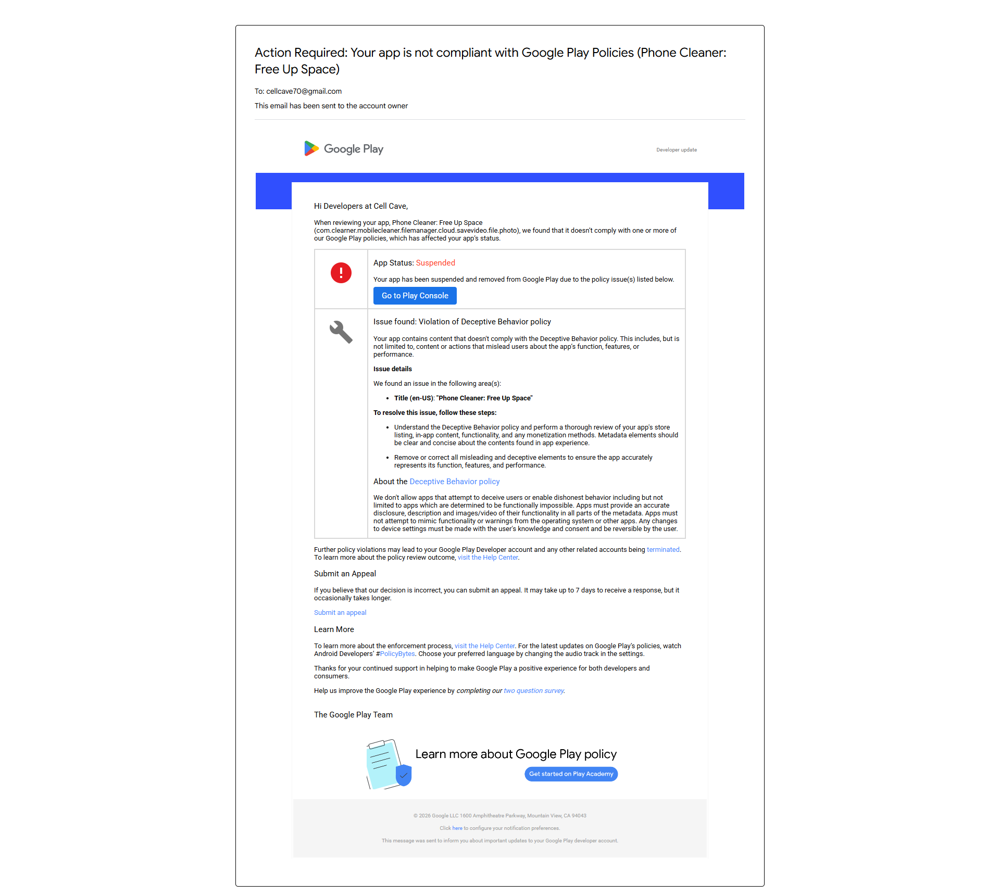

**App suspension notice — open the full screenshot** · The email we received from Google Play, 7 Oct 2026 · opens in a new tab

### What the notice actually says

Read closely, the email is narrower than it feels — and vaguer than it looks.

| Developer | Cell Cave |
| --- | --- |
| App | Phone Cleaner: Free Up Space |
| Package | `com.clearner.mobilecleaner.filemanager.cloud.savevideo.file.photo` |
| Status | Suspended removed from Google Play |
| Policy | Deceptive Behavior |
| Area found | Title (en-US): "Phone Cleaner: Free Up Space" |
| Escalation warning | Further violations may lead to termination of the developer account "and any other related accounts" |
| Appeal | Available; the notice says a response may take **up to 7 days**, occasionally longer |

### What the notice does *not* say

- **Which words in the title** are the problem. "Phone Cleaner" and "Free Up Space" are both reproduced, with no indication of which matched.
- **Why** the title is deceptive — no mapped sub-clause, no explanation, no comparison to the app's behaviour.
- **Anything about the app itself.** No in-app finding, no screenshot finding, no permissions finding, no monetization finding.
- **Anything about the description**, even though the policy text quoted in the same email covers "all parts of the metadata".
- **What a compliant title would look like.** The remedy given is generic: review the listing, remove misleading elements.

How we treated that silence

Because the notice names one field and gives no sub-clause, we did not limit ourselves to the title. We re-read the quoted policy text, which covers "all parts of the metadata", and audited every field of our listing — title, short description, long description, screenshots, feature graphic and icon — against it. Everything in this page follows from that audit.

### The policy text Google quoted back in the email

We don't allow apps that attempt to deceive users or enable dishonest behavior including but not limited to apps which are determined to be functionally impossible. Apps must provide an accurate disclosure, description and images/video of their functionality in all parts of the metadata. Apps must not attempt to mimic functionality or warnings from the operating system or other apps. Any changes to device settings must be made with the user's knowledge and consent and be reversible by the user.

Quoted in the suspension email, 7 Oct 2026

Three of those four sentences do not describe our app: it is not functionally impossible, it does not mimic operating-system warnings, and it changes no device settings. **The sentence that applies to us is the second one** — accurate disclosure and description "in all parts of the metadata". That is the sentence we have worked to satisfy, and it points at the description and the screenshots as much as at the title.

<a id="policy"></a>

Section 2

## The Deceptive Behavior policy, clause by clause

Five clauses. Only one of them can plausibly reach this app — and it is the one that names the title.

| Clause | What it prohibits | Reaches this app? |
| --- | --- | --- |
| **1 · Misleading Claims** | False or misleading information or claims, in the description, title, icon and screenshots. Features that are impossible to deliver, even as a joke. Improper categorization. False claims of official status or government affiliation. | Yes — this is the clause<br>The only clause in the whole policy that names the title. |
| **2 · Deceptive Device Settings Changes** | Changing device settings or features outside the app without the user's knowledge and consent; changes that cannot be reversed; misleading the user into removing third-party apps; incentivising removal of other apps outside a verifiable security service. | No<br>The app changes no system settings. Deletions are user-selected and go to a 7-day Recycle Bin. |
| **3 · Enabling Dishonest Behavior** | Fake identity or credential documents; downloading additional resources without a prompt and a disclosed size; different behaviour by geography or device; changing significantly between versions without alerting users; modifying behaviour during review. Apps must "perform as reasonably and accurately expected by the user". A "prank" or "entertainment" label does not exempt an app. | Only indirectly<br>"Perform as reasonably expected" is the sentence a reviewer could pair with an overstated description. |
| **4 · Manipulated Media** | Deceptively manipulated media that may mislead about sensitive events, politics or social issues. | No |
| **5 · Behavior Transparency** | "Your app's functionality should be reasonably clear to users; don't include any hidden, dormant, or undocumented features within your app." Also covers evading review. | No<br>Arguably an argument *for* the app: it ships more than it advertises, not less. See the [reverse audit](#proof). |

<a id="metadata"></a>

Section 3

## Metadata audit, line by line

Every field of the suspended listing, set against what our own QA round of 17 Sep 2026 found in the build. We graded ourselves harshly on purpose: this is the audit a reviewer would run, not the one we would have liked.

#### Title · 28 of 30 characters

Phone Cleaner: Free Up Space

Exposed, not false

Within the length limit. No emoji, no ALL CAPS, no ranking or price claim. Our app does clean and does free space, measurably — Home reads real figures from StatFs, and Junk Clean reports the bytes it actually moved. The exposure is the token "Free", plus the outcome-promise shape. **We have replaced this title.**

#### Short description · 73 of 80 characters

Junk cleaner to remove duplicate photos, clear app cache & free up space.

Every element supported

Four claims, four features we ship: junk cleaning, duplicate photo removal, app-cache clearing, space recovery. This was the strongest field in the listing and it survives the rewrite nearly intact — we removed only the word "free".

### Long description · claim-by-claim

| Claim in the suspended listing | Verdict | What our device testing actually showed |
| --- | --- | --- |
| "all-in-one smart storage manager and media organizer" | Supported | 18 tools in the grid, all opened in QA with 0 crashes. |
| "clear residual data … reclaim valuable phone memory" | Supported | Junk Clean moved 16.9 MB to the bin; after our fix round the result equals the button figure (14.4 MB). |
| "remove similar images" | Partly | Media Cleanup is labelled "Duplicates & blurry" in the app, but the Duplicate Photos screen groups strictly by "Identical copies · keep one". Similarity matching was not demonstrated in that QA round. |
| "deep directory scans … analyze file usage" | Supported | Quick and deep junk scan; Storage analyses by category; AI Analyzer reports 121.5 MB reclaimable. |
| "obsolete APK files, temporary logs, system clutter, leftover app data" | Partly | Junk Clean is captured finding app cache and residual files. The APK / log / leftover breakdown is not itemised on any captured screen, so we narrowed the wording. |
| "detect exact duplicate photos, similar shots, blurred images, and accidental screenshots" | Partly | Exact duplicates: proven (25 sets, 54 photos). Screenshots: proven — the detected files are Screenshot_2026…. Similar and blurred: carried by the tool's own subtitle, not demonstrated in that round. |
| "Compare photos side-by-side to preview, select, and delete … in a single tap" | Reworded | The screen is a thumbnail list with per-file checkboxes and one "Delete 4.6 MB" action. Preview, select and one-tap delete are all true; "side-by-side" is not what our UI does, so that phrase is gone. |
| "heavy video files, old screen recordings, and duplicate audio tracks" | Split verdict | **Heavy videos and old screen recordings: true** — our build finds and removes both; the 17 Sep test device simply held none. **Duplicate audio tracks: our app does not do this.** We removed that phrase from the description. |
| "clear app cache across high-usage installed software" | Supported | Junk Clean with read-only access finds precisely the app cache. |
| "Monitor app storage distribution … uninstall rarely used applications" | Supported | App Manager lists 12 apps with sizes and carries an "unused" filter. |
| "visual breakdown of internal storage **and SD card** usage across documents, downloads, and media categories" | True, not captured | Storage shows 18% used, 5.0 GB of 27.5 GB, Videos and Photos categories and a largest-files list. Our app also scans an SD card and acts on it; **the test device had no SD card attached**, which is the only reason no capture exists. |
| "Sort files by size, date, or category" | Supported | File Manager browses internal storage; Large Files sorts by size. |
| **"Social Media Folder Cleanup"** — "Target dedicated media folders created by popular messaging and social network apps" · "Locate and delete duplicate voice notes, sent video clips, received stickers, and cached media attachments" | Not a feature of our app | **We do not ship this as a feature.** Those folders are cleaned within general cleanup, but there is no messenger or social tool among our 18 tools and no such screen exists. **This was the most serious thing in our listing, and the whole block has been removed.** |
| "Process all file analysis … locally on-device without uploading your files" | Supported | AI Assistant is an on-device storage assistant; no file upload path exists in the build. |
| "Review app permission accesses" | Supported | Privacy & Security runs a permission audit and a clipboard cleaner. |
| "Built with direct functionality and full adherence to developer policy guidelines" · "avoids false claims, deceptive promises, or misleading features" | Removed | True of our app, but a store listing should not assert its own policy compliance. We say what the app does and let the behaviour make the argument. |
| *Ads were not mentioned anywhere in the description* | Gap, now closed | The app is ad-supported with a subscription that removes ads. The suspended description did not say so. **Our corrected description states it plainly.** |

<a id="risk"></a>

Section 3b

## Risk register — with our disposition, 7 Oct 2026

Every risk the audit raised, and what we decided to do about each one.

**Done** = corrected, and named in our appeal text. **Keep** = the feature exists and the claim stands; no action needed, not mentioned in the appeal. **Scheduled** = cannot be actioned while the app is suspended; queued for the first release after reinstatement.

| # | Risk | Disposition | Where it stands now |
| --- | --- | --- | --- |
| **R1** | "Social Media Folder Cleanup" block | Done | Block removed in full. Our app does clear junk, thumbnails and unwanted notifications, but **not** messenger-folder cleanup as a named feature — so the wording goes rather than being softened. **Named in our appeal.** |
| **R2** | "heavy video files", "old screen recordings", "duplicate audio tracks" | Keep + Done | **Split.** Heavy videos and screen recordings work in our build — absent from the QA captures only because the test device held none, so the claims stand. **Duplicate audio detection is not in our app** and the phrase has been removed from the description. That part is **Done** and is named in our appeal alongside R1. |
| **R3** | "SD card usage" | Keep | Our app scans an SD card and performs every action on it. The test device had no SD card attached, which is why no capture exists. The claim stands. |
| **R4** | "similar shots, blurred images" | Keep | Supported by the build — Media Cleanup is labelled "Duplicates & blurry" in the app's own tool grid. |
| **R5** | "Compare photos side-by-side" | Keep | Preview, per-file selection and one-tap delete are all demonstrated on our Duplicate Photos screen; only the words "side-by-side" were dropped. |
| **R6** | "obsolete APK files, temporary logs" | Keep | Junk Clean's own on-screen text names the places it collects from: app cache, thumbnail caches, leftover installer files and temp/log files in Downloads. |
| **R7** | The word "Free" in the title and short description | Done | Removed from both fields. **Named in our appeal.** |
| **R8** | Ads and subscription undisclosed | Done | The description now states that the app is ad-supported and that a subscription removes ads. **Named in our appeal.** |
| **R9** | Self-asserted policy compliance in the listing | Done | Both lines deleted. **Named in our appeal.** |
| **R10** | MANAGE_EXTERNAL_STORAGE declaration | Reviewed | All-files access is declared because our cleaning, duplicate and large-file tools must read and remove files wherever the user stored them; the app relies on the file management (including maintenance) permitted use, and the permission is requested only when a feature needs it, with an explanation first. |
| **R11** | Do not introduce "System Cache Cleaner", "RAM Booster", "Speed Optimizer" | Done | None of these terms will be added to our metadata. They describe measurement rather than improvement, and we will not claim an improvement we cannot measure. |
| **R12** | Store screenshots 1 and 3 stated impossible and self-contradicting figures | Done | **The full screenshot set has been replaced with captures from our submitted build.** Screenshot 3 was rebuilt from the app’s own result screen; 1 and 2 were recaptured at the figures the app produces. The new set is published in [App Details → Graphics](../../tabs/02-app-details/#graphics). **Named in our appeal.** |
| **R13** | In-app tool names: Phone Boost, CPU Cooler, Battery Saver | Scheduled | Renaming in-app tools requires a new build, and a suspended app accepts no uploads. It is not needed for this appeal; it is queued for the first release after reinstatement. The screens themselves already decline the usual claims — Phone Boost tells the user that Android reclaims memory itself. |

<a id="freeup"></a>

Section 4

## "Free Up Space" in the title — the case for and against

The notice names the title, so we set out both sides of the phrase honestly. We have removed it regardless; this is the reasoning behind that decision.

### The case that the title is compliant

1. **It reclaims, it does not conjure.** Reclaiming space is not the same as increasing storage capacity. The title promised an operation our app performs, not a capacity increase no software can deliver — which is the line the "functionally impossible" rule actually draws.
2. **No rule forbids it.** The metadata policy's title rules cover length, ranking claims, price and promotional claims, emoji and capitals. An outcome phrase is not on that list, and the Deceptive Behavior policy bans only claims that are false or misleading.
3. **The claim is true and measured.** Our app frees space, reports the real figure, and reads actual device storage. The published example of a violation is an antivirus with no virus detection — the opposite of an app that does exactly what its title says.
4. **It is accurate, not aspirational.** "Free up space" describes the function of a storage cleaner in the plainest words available, and Google's own guidance asks that a title accurately describe an app's functionality.

### The case Google could make

1. **"Free" reads as promotional.** Play's listing guidance names "Free" as deal-promoting language and the metadata policy bans promotional text in titles. An automated check does not parse it as a verb.
2. **An outcome is not guaranteed.** On a device with little to clean, the app cannot deliver what the title promises. "Perform as reasonably and accurately expected by the user" sits in the same policy.
3. **Category prior.** Titles of the shape <Category>: <Promise> are common in deceptive cleaner listings, so the shape itself carries signal regardless of how honest a particular app is.

Our decision

We accept the second column. The phrase has been removed from both the title and the short description, and our new title names the two things the app actually shows you on screen: **Phone Cleaner: Junk & Photos**.

<a id="proof"></a>

Section 5 · the evidence exhibit

## Metadata Features Proved with App Screenshots

Every feature our listing claims, set beside the screen in our app that performs it. These screenshots were captured on LD Player (Android 9, 720×1280, 320 dpi) on 17 Sep 2026 during our QA round — from the real build, not from mockups. Tap any screen to enlarge.

About these captures

They come from our QA build of 17 September 2026. The APK on Google Play is **later** than that build — QUERY_ALL_PACKAGES was removed between the two. The features and the screens are the same, so this mapping stands as an audit of our claims, and we recapture from the submitted build for anything we send to Google as evidence.

**23** · listing claims audited · **15** · proved by a screenshot · **6** · partly proved — reworded · **2** · not proved — removed · **10** · features we ship that the listing never claimed

### A · Title and short description

Proved

#### "Free up space" — our app frees space, and says how much

Title: "Phone Cleaner: Free Up Space" · Short description: "… clear app cache & free up space."

Home reads real device storage through StatFs — 5.0 GB used of 27.5 GB, not an invented figure. Junk Clean moves the bytes it reports: 16.9 MB in the audited build, and after our fix round the result screen equals the figure on the button exactly, 14.4 MB. Nothing is estimated upward for effect.

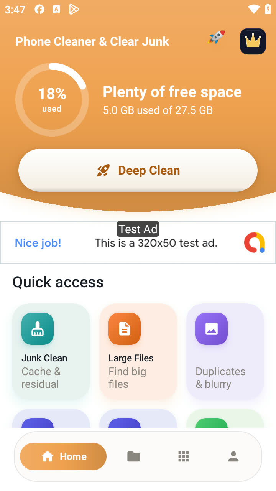

**Home**5.0 GB of 27.5 GB

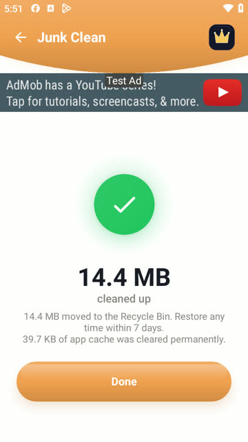

**Junk result**14.4 MB, matching the button

Proved

#### "all-in-one smart storage manager"

"Our utility tool functions as an all-in-one smart storage manager and media organizer"

Our tools grid carries 18 tools. Every one was opened during the QA round with zero crashes. The grid header reads "All Tools"; the first six are AI Assistant, AI Analyzer, Junk Clean, Storage, Large Files and Media Cleanup.

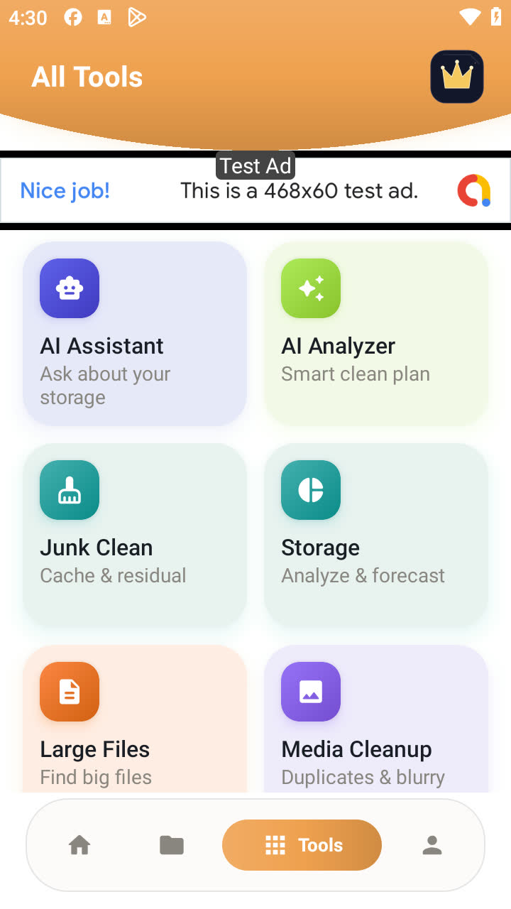

**All Tools**18 in the grid

### B · Junk Cleaner & Residual File Removal

Proved

#### Deep storage scans for cache and residual data

"Conduct deep storage scans to locate obsolete APK files, temporary logs, system clutter, and leftover app data" · "Clear hidden directory clutter"

Junk Clean is captured in three states: with read-only access it finds the app cache and asks for more; with full access it completes a scan and moves 16.9 MB to the Recycle Bin; and the fixed build announces on the button itself that an ad plays before the clean runs. The tool's own subtitle in the grid is "Cache & residual".

Reworded The APK / log / leftover split is not itemised on screen, so our corrected description claims "cache and residual files", which is what the app shows.

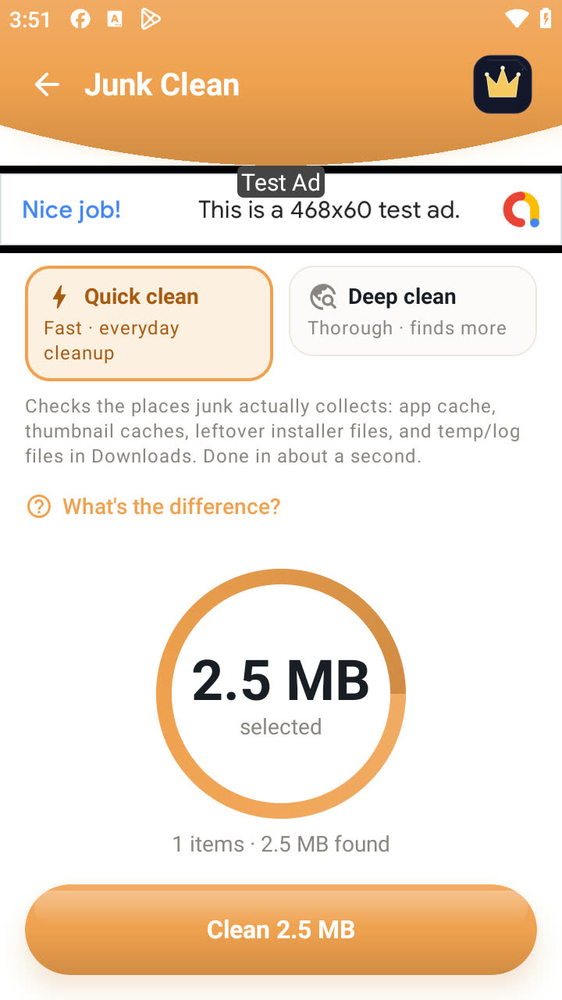

**Junk Clean**Cache found


**Result**16.9 MB moved


**Clean button**Ad announced


**AI Analyzer**121.5 MB reclaimable

Proved

#### "Safely identify and select useless system files"

"Safely identify and select useless system files to reclaim internal storage space"

"Safely" is literal here: every deletion goes to a Recycle Bin with a 7-day restore window, and a restored file was verified byte-identical by SHA-256 on the device. The bin lists each item with its own permanent-delete control.

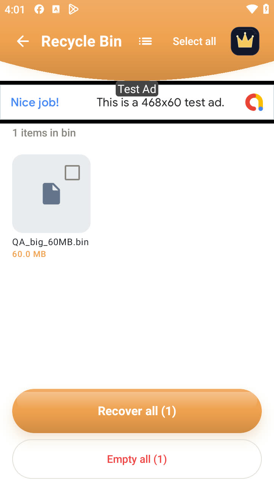

**Recycle Bin**Restored, SHA-256 identical

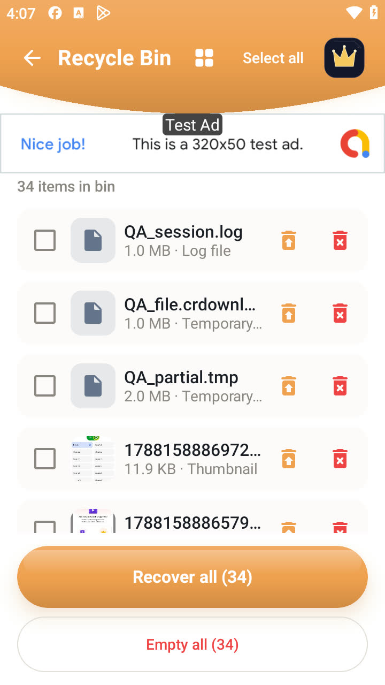

**Bin list**Per-item delete

### C · Duplicate Photo & Similar Media Cleaner

Proved

#### Duplicate photos and accidental screenshots are detected

"Scan your photo gallery to detect exact duplicate photos … and accidental screenshots"

The screen reports "25 duplicate sets · 54 photos", groups them under "Identical copies · keep one", and the detected files are named Screenshot_20260731-… — so both halves of the claim, exact duplicates and screenshots, are visible in a single capture. Sizes are shown per file and the action button carries the total, "Delete 4.6 MB".

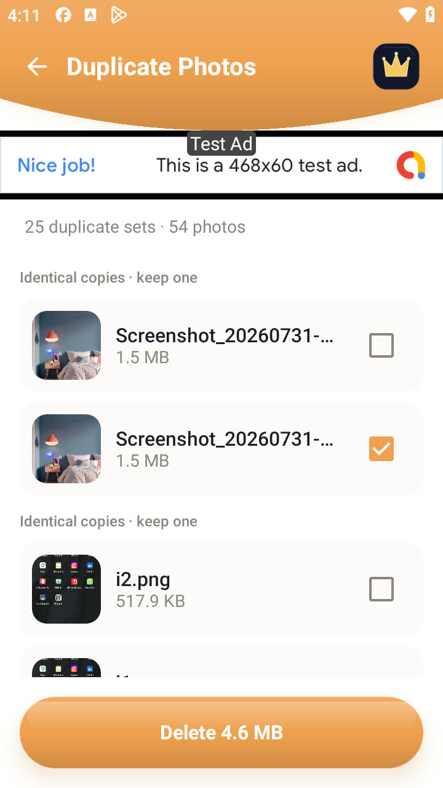

**Duplicate Photos**25 sets · 54 photos

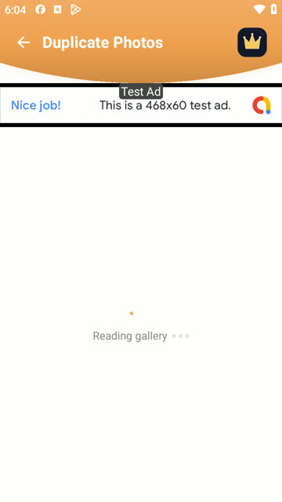

**Refresh**Choices kept

Proved

#### Preview, select and delete — with a confirmation step

"Compare photos side-by-side to preview, select, and delete unwanted images in a single tap"

Every copy is listed with a thumbnail, a filename and a size, each with its own checkbox, and deletion is confirmed before it runs. Preview, selection and one-tap deletion are all demonstrated.

Reworded Our layout is a list, not a side-by-side comparison, so the corrected description says "preview every copy before anything is deleted".

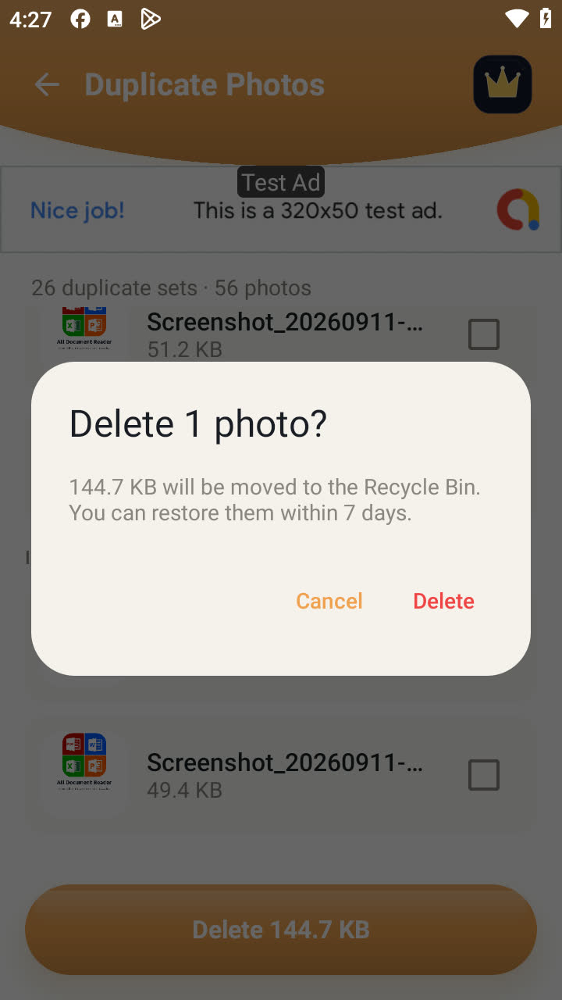

**Confirm**Before deletion

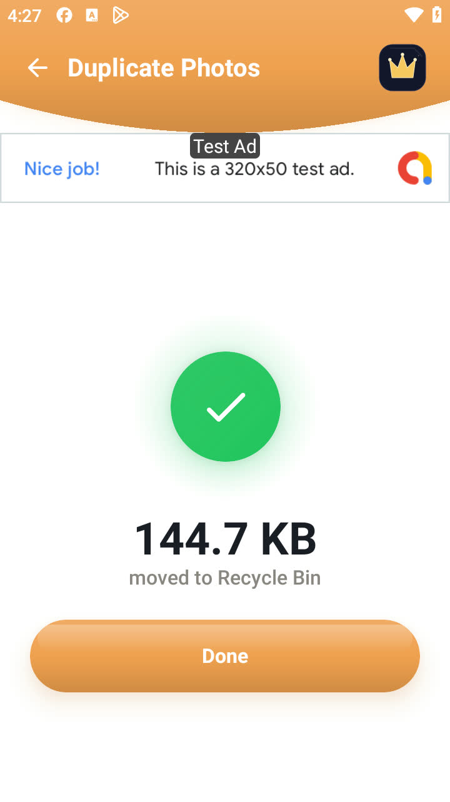

**Result**Moved to the bin

Proved

#### Large media files are found and removed

"Organize oversized media by identifying heavy video files…"

Large Files found a 60 MB file and moved it to the Recycle Bin; the same file appears at the top of the Storage screen's "Largest files" list at 60.0 MB. The claim about heavy media files is demonstrated end to end.

True, not captured Old screen recordings work in our build; the QA device held none, so no capture exists. We recapture these on a loaded device for the evidence pack.

Removed **"Duplicate audio tracks" is not a feature of our app.** As with Social Media Folder Cleanup, there is no screen to show because there is nothing behind it. The phrase has come out of the description.


**Large Files**60 MB removed

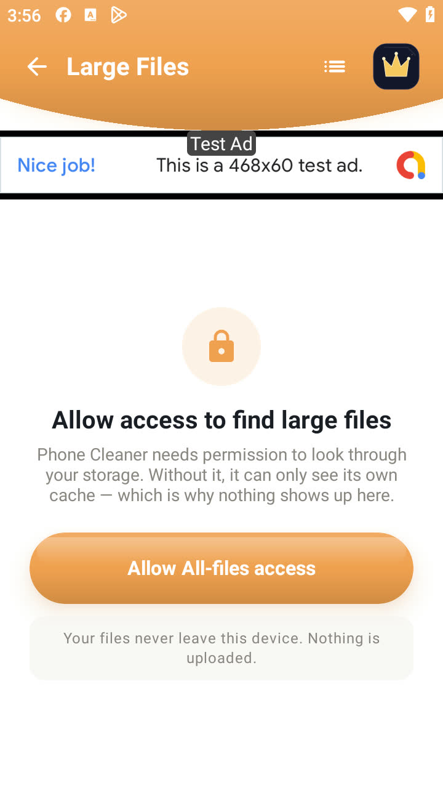

**Access**Asked, then granted

### D · Cache Cleaner & Application Manager

Proved

#### App cache, app sizes and uninstalling unused apps

"Scan temporary application data to clear app cache" · "Monitor app storage distribution to identify which applications occupy excessive memory" · "Uninstall rarely used applications or review installed packages"

All three are a single screen plus one. Junk Clean under read-only access finds precisely the app cache — the capture exists because it *only* found cache, which is the clearest possible proof of the feature. App Manager lists 12 installed apps with their sizes and carries an "unused" filter, which is the "rarely used applications" claim exactly.


**Cache scan**App cache found


**App Manager**12 apps, sizes, unused filter

### E · Storage Analyzer & File Organizer

Proved

#### Visual storage breakdown and largest files

"Gain a detailed visual breakdown of internal storage and SD card usage across documents, downloads, and media categories" · "Sort files by size, date, or category" · "Review hidden folder structures"

**Proved:** Storage shows a ring at 18% used, the real figures 5.0 GB of 27.5 GB, a split bar with Videos 15.2 MB and Photos 11.4 MB, and a "Largest files" list headed by a 60 MB file with a Manage action. File Manager browses internal storage directly.

True, not captured The SD-card view works in our build; the test device had no card attached. The capture shows internal storage only for that reason, not because the feature is missing.


**Storage**18% used · categories · largest files


**File Manager**Internal storage

### F · Social Media Folder Cleanup

Not proved — removed from our listing

#### There is no screen to show, because we do not ship this feature

"Target dedicated media folders created by popular messaging and social network apps." · "Locate and delete duplicate voice notes, sent video clips, received stickers, and cached media attachments."

This is the only block in our suspended listing with nothing behind it. There is no messenger or social tool among our 18 tools and no such screen was captured in the QA round. Those folders are cleaned within general cleanup, but we were describing it as a feature, and it is not one.

**What we did:** the entire block has been removed from the description rather than softened. Presenting this honestly is what makes the rest of the audit credible.

No screen exists · **Nothing to show**Block removed

### G · Privacy & Local Device Security

Proved

#### On-device processing and a permission audit

"Process all file analysis, duplicate media detection, and cache scanning locally on-device without uploading your files." · "Review app permission accesses to keep your personal data and sensitive media private."

Privacy & Security runs a permission-risk audit and a clipboard cleaner. The AI Assistant is an on-device storage assistant — our build contains no upload path for user files. Consent is revisitable: the fixed build reopens the consent form from the Me tab, which is the behaviour a privacy claim has to be able to support.


**Privacy**Permission audit


**AI Assistant**On-device


**Consent**Changeable

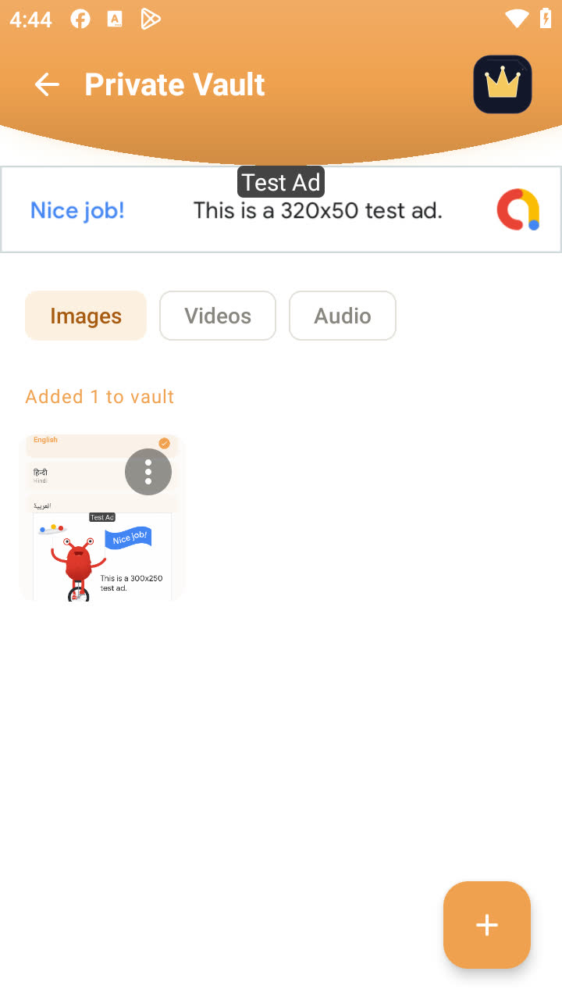

**Vault**PIN-locked

### H · "Avoids false claims, deceptive promises, or misleading features"

Proved — and this is the exhibit that matters most to us

#### Our app refuses the four claims this category is built on

"Storage manager avoids false claims, deceptive promises, or misleading features." · "Built with direct functionality and full adherence to developer policy guidelines."

**No fake memory boost.** Phone Boost does not claim to speed the device up. Its own copy tells the user that Android reclaims memory itself — a cleaner app voluntarily declining the most common deceptive claim in its category.

**No invented numbers.** CPU Cooler reports real temperature and CPU facts. System Monitor shows RAM 1.2 of 5.8 GB and storage 5.0 of 27.5 GB — device figures, not theatre. Battery Saver shows live battery status.

**No deceptive monetization.** Our paywall once listed perks that free users already had; it now sells only "No ads", with the plans shown before the Continue button. The rewarded ad is announced on the button before it plays.

Lines removed anyway These statements are true of our app, but a store listing should not assert its own compliance. We removed both sentences and let these screens make the argument instead.

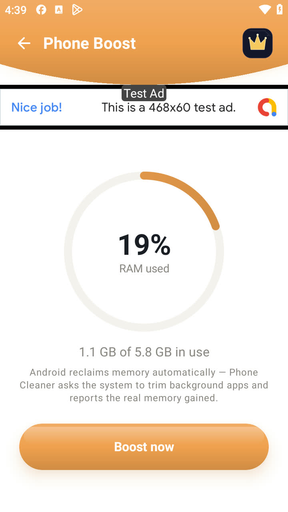

**Phone Boost**No fake boost claim

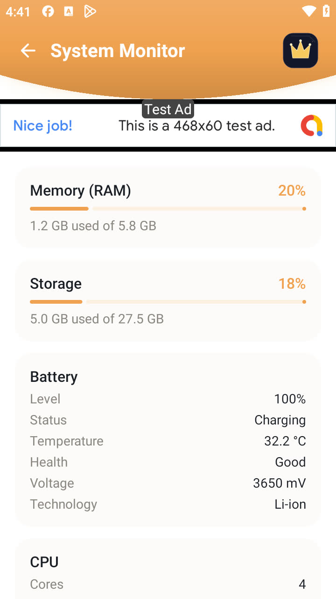

**System Monitor**Real figures


**CPU Cooler**Real temperature

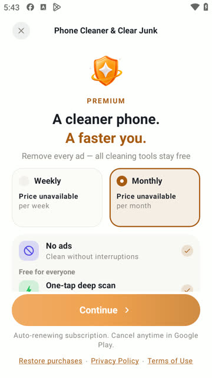

**Paywall**Only "No ads" sold

### I · The reverse audit — what our app has that the listing never claimed

Deceptive Behavior is about a listing that promises more than the app delivers. Our listing does the opposite on ten features: they are in the build, they were tested, and the store copy never mentioned them.


**Recycle Bin**7-day restore, never claimed


**Private Vault**PIN and biometrics


**AI Assistant**Storage Q&A


**Notifications**Opt-in cleaner

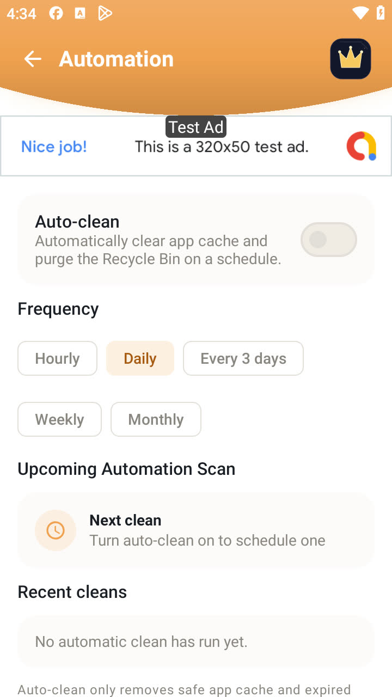

**Automation**Scheduled clean


**Battery Saver**Live status

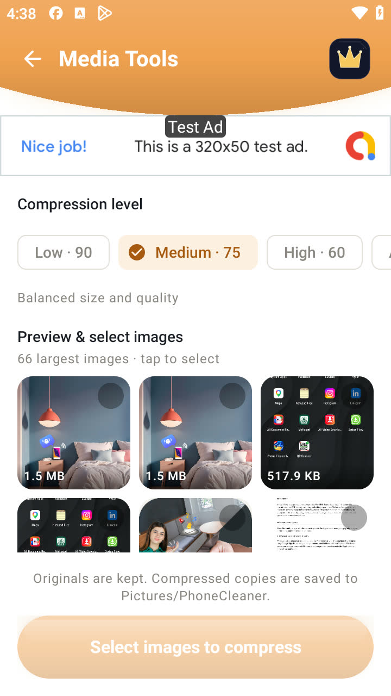

**Media Tools**Image compressor


**System Monitor**Live CPU, RAM, battery


**CPU Cooler**Real temperature


**Phone Boost**Honest memory copy

Nine languages, two of them right-to-left

706 strings translated into English, Hindi, Arabic, Urdu, Turkish, German, Portuguese (BR), Chinese and French, with mirrored layouts for Arabic and Urdu, and no missing strings. The suspended listing claimed none of it; our corrected description now mentions it.

### Summary of the exhibit

| Listing block | Claims | Proved | Partly | Not proved |
| --- | --- | --- | --- | --- |
| Title and short description | 5 | 5 | 0 | 0 |
| Junk cleaner & residual file removal | 3 | 2 | 1 | 0 |
| Duplicate photo & similar media cleaner | 3 | 1 | 2 | 0 |
| Cache cleaner & application manager | 3 | 3 | 0 | 0 |
| Storage analyzer & file organizer | 3 | 2 | 1 | 0 |
| **Social media folder cleanup** | 2 | 0 | 0 | **2** |
| Privacy & local device security | 2 | 2 | 0 | 0 |
| Why choose / key highlights | 2 | 0 | 2 | 0 |
| Total | 23 | 15 | 6 | 2 |

Fifteen of twenty-three claims are demonstrable from a screenshot of our shipped build. Six needed the wording narrowed to what the device shows, and we narrowed them. Two had to come out, and they are out. After those eight corrections, every word of our listing is provable — which is the state the listing is in now.

<a id="graphics"></a>

Section 6 · store listing graphics

## The screenshots, the icon and the feature graphic

The clause being enforced names four fields: "the description, **title**, **icon**, and **screenshots**." We audited all four. Two of them — the icon and the screenshots — turned out to matter more than the title.

This changed the ranking of every finding in our audit

Up to this point the worst item in our listing was the "Social Media Folder Cleanup" block — a described feature we do not ship. **Our screenshots were worse.** One of them stated a result that is arithmetically impossible on the device it depicted, and another contradicted itself inside a single frame.

The suspension email quotes the policy sentence about apps "determined to be **functionally impossible**". Screenshot 3 was the clearest example of that sentence anywhere in our listing — clearer than the title, clearer than the description. **The entire screenshot set has since been replaced with captures from our submitted build.**

### Issues Identified

| Asset | Verdict | The problem in one line |
| --- | --- | --- |
| **Screenshot 3** · "Remove Junk With AI" | Critical | Claims 387.7 GB cleaned on a 27.5 GB device, a 96%→8% storage drop, and "3.2 Hours" saved. Three impossible or unmeasurable claims in one image. |
| **Screenshot 1** · "Phone Storage Cleaner" | Critical | The ring reads "85 % Used" while the text beside it reads "5.0 GB Used / 27.5 GB", which is 18%. The frame contradicts itself. |
| **Screenshot 2** · "Delete Duplicate Items" | High | Figures inflated roughly 500× above anything the app has been shown doing, and the totals inside the frame do not reconcile. |
| **Feature graphic** | Medium | Carries "Phone Junk Cleaner" — not the store title, and the opening of a live 500K+ app's title. Its three feature claims are all real. |
| **Icon** | Low–medium | The shield badge reads as security or antivirus, which this app is not. |
| **Screenshot 4** · "App Manager" | Acceptable | Placeholder app names rather than real ones, but the feature and the interaction are genuine. |
| **Screenshot 5** · "Helpful Tools" | Good — the model | A real capture of the real screen. This is what the other four should look like. |

What we did about it

We replaced the whole screenshot set with unedited captures from the submitted build. Screenshot 3 was rebuilt from the app’s own result screen: the impossible 387.7 GB, the fabricated 96%→8% and the unmeasurable “3.2 Hours” are gone, and it now reports an amount and a file count the app actually produces. Screenshots 1 and 2 were recaptured at the real figures. Screenshots 4 and 5 were already honest and are kept. The feature graphic now carries the store title verbatim.

<a id="verification"></a>

Section 7 · graphics verification

## Each store graphic against the screen it claims to show

Section 6 says what was wrong with our artwork. This section proves it: every store asset placed beside the matching capture from our shipped build, with the figures compared side by side. The left frame is what Google Play showed. The right frame is what our app does.

**7** · store assets checked · **3** · verified against the build · **2** · feature real, figures unverified · **2** · contradicted by the build

### V6 · Feature graphic — the three advertised features

Our feature graphic makes exactly three feature claims. All three are in the build.

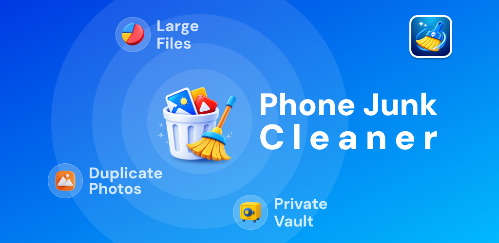


**Large Files**Verified 60 MB file removed


**Duplicate Photos**Verified 25 sets, 54 photos


**Private Vault**Verified PIN and biometrics

The one defect was the name, not the claims

The graphic read **"Phone Junk Cleaner"** while our store title was **"Phone Cleaner: Free Up Space"** and the app's own home screen reads **"Phone Cleaner & Clear Junk"**. Three surfaces, three names. **We have put the store title on the graphic verbatim**; the launcher label needs a new build and is queued with R13 for the first release after reinstatement.

Store listing

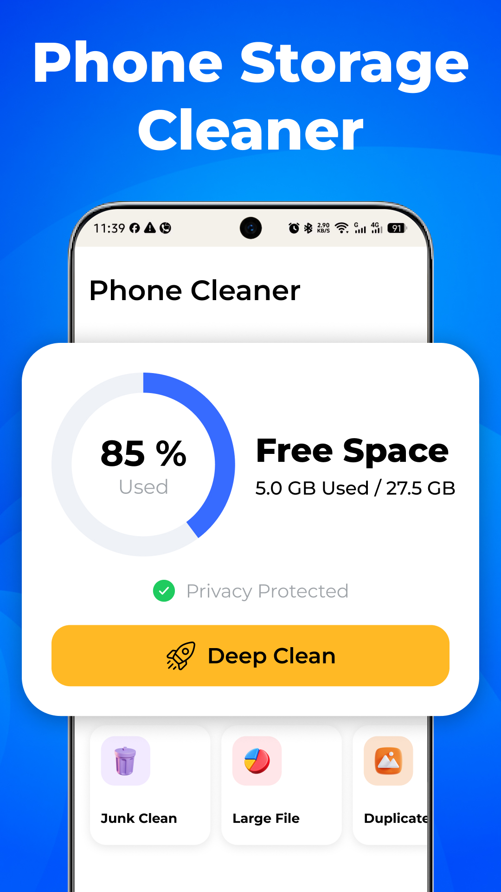

**"85 % Used"**

The app


**"18% used"**

Contradicted

### V1 · Storage usage

| Value | Store screenshot | Shipped build | Agrees? |
| --- | --- | --- | --- |
| Percentage used | **85 %** | **18 %** | No |
| Space used | 5.0 GB | 5.0 GB | Yes |
| Total capacity | 27.5 GB | 27.5 GB | Yes |
| 5.0 ÷ 27.5 | **= 18.2 %**, which is what the build shows and what the store screenshot's own GB values imply |  | Store self-contradicts |

The GB figures had been carried over from the real screen unchanged; only the percentage was altered. **What we did:** recaptured this screen from the build at the real 18%. An honest low number is a better screenshot than an invented high one.

Store listing

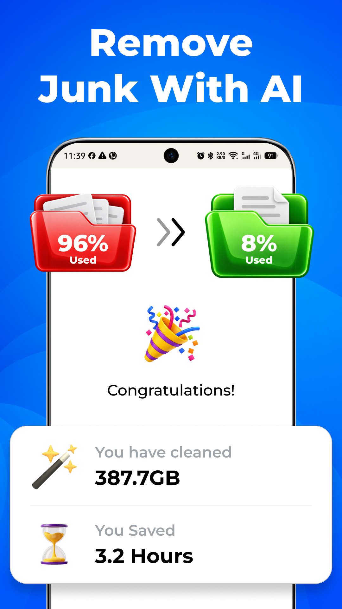

**"387.7GB" · 96%→8%**

The app


**"16.9 MB moved to Recycle Bin"**

No such screen exists

### V2 · Junk cleaning result

| Claim | Store screenshot | Shipped build | Verdict |
| --- | --- | --- | --- |
| Data cleaned | **387.7 GB** | 16.9 MB moved to the bin; 2.8 MB of app cache cleared permanently | 14.1× the whole device |
| Storage before / after | 96 % → 8 % | No before/after screen exists in the app | Fabricated |
| Time saved | 3.2 Hours | The app has no timing or benchmark of any kind | Unmeasurable |
| Largest figure the app has produced | AI Analyzer: **121.5 MB reclaimable**, Smart Clean 53.8 MB |  | 3,200× smaller |

Our real result screen is not only accurate, it is **deliberately conservative**: it tells the user space is freed only when the Recycle Bin is emptied, and separates the 2.8 MB cleared permanently from the 16.9 MB that is still recoverable. **What we did:** this screenshot was rebuilt from the app’s own result screen. Every number on the old one was invented, so none of it was kept; the replacement reports the amount cleaned and the file count the app itself shows. The new set is in [App Details → Graphics](../../tabs/02-app-details/#graphics).

Store listing

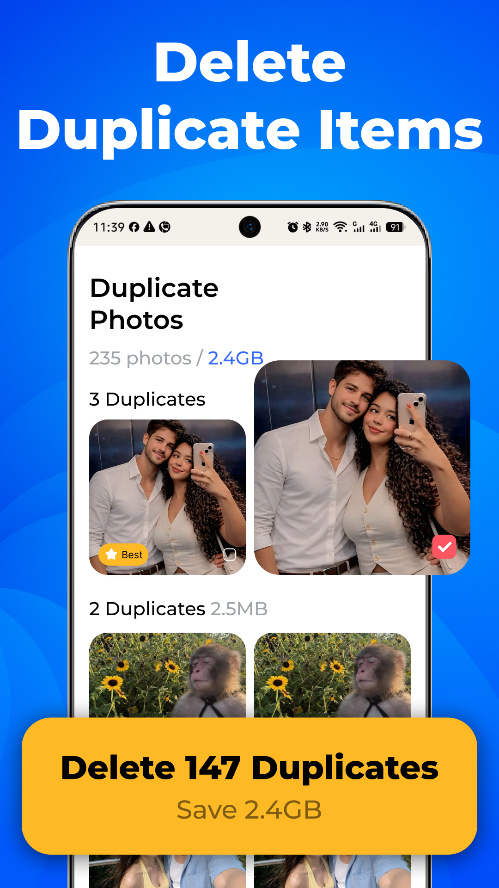

**"235 photos / 2.4GB"**

The app


**"25 duplicate sets · 54 photos"**

Feature real, figures unverified

### V3 · Duplicate photos

| Element | Store screenshot | Shipped build | Verdict |
| --- | --- | --- | --- |
| Scan summary | 235 photos / 2.4 GB | 25 duplicate sets · 54 photos | ~500× larger |
| Delete action | Delete 147 Duplicates · Save 2.4GB | Delete 4.6 MB | Unevidenced |
| Internal arithmetic | 147 of 235 photos cannot save the same 2.4 GB that all 235 occupy |  | Inconsistent |
| Grouped duplicate sets | Yes | Yes — "Identical copies · keep one" | Matches |
| Per-file checkbox and preview | Yes | Yes, with thumbnails and sizes | Matches |
| Running total on the button | Yes | Yes | Matches |
| "Best" badge on the copy to keep | Yes | Not present in the captured build | Verify on device |

The **interaction design was honest** — five of seven elements match the real screen. Only the magnitudes were inflated. **What we did:** recaptured this screen from the build so the figures are the ones the app produces.

Store listing

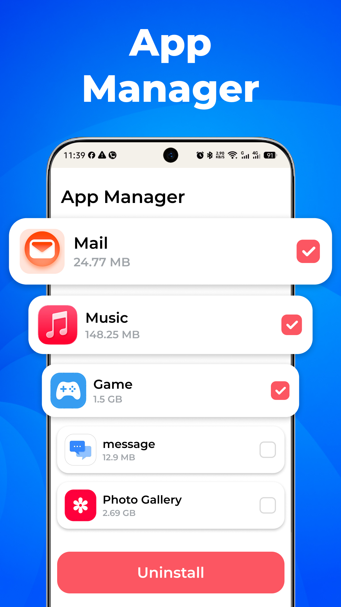

**Mail · Music · Game**

The app


**12 apps with sizes**

Feature verified

### V4 · App manager

| Element | Store screenshot | Shipped build | Verdict |
| --- | --- | --- | --- |
| Installed apps listed with sizes | Yes | Yes — 12 apps | Matches |
| Multi-select with checkboxes | Yes | Yes | Matches |
| Uninstall action | Yes | Yes (REQUEST_DELETE_PACKAGES declared) | Matches |
| App names shown | Placeholders | Real installed apps | Deliberate and correct |
| "Unused" filter | Not shown | Present | Under-claims |

We use invented app names here deliberately, to keep other companies' brands and icons out of our listing. **What we did:** kept this screenshot, and kept the placeholder icons abstract enough that none of them reads as a real product.

Store listing

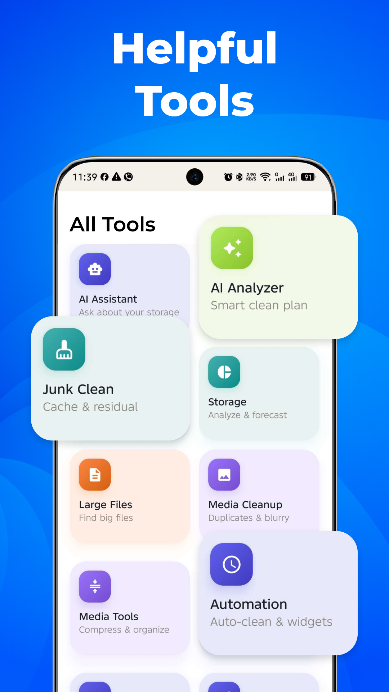

**8 tool tiles**

The app


**Same tiles, same subtitles**

Fully verified — tile for tile

### V5 · Tools grid

| Tile | Subtitle in the store screenshot | Subtitle in the build | Match |
| --- | --- | --- | --- |
| AI Assistant | Ask about your storage | Ask about your storage | Exact |
| AI Analyzer | Smart clean plan | Smart clean plan | Exact |
| Junk Clean | Cache & residual | Cache & residual | Exact |
| Storage | Analyze & forecast | Analyze & forecast | Exact |
| Large Files | Find big files | Find big files | Exact |
| Media Cleanup | Duplicates & blurry | Duplicates & blurry | Exact |
| Media Tools | Compress & organize | — | Below the fold in the capture |
| Automation | Auto-clean & widgets | — | Below the fold in the capture |

Six tiles are word-for-word identical to the shipped build and the remaining two sit below the fold of the capture rather than being absent — our tools list runs to 18. **This asset needed no change at all**, and it is the proof that the set could be rebuilt honestly without losing any visual polish.

### Verification summary

| # | Asset | Verdict | What we did |
| --- | --- | --- | --- |
| V1 | Screenshot 1 · Storage | Contradicted by the build and by itself | Recaptured at the real 18% |
| V2 | Screenshot 3 · Junk with AI | No such screen exists; figure impossible | Rebuilt at real figures |
| V3 | Screenshot 2 · Duplicates | Design matches, figures ~500× inflated | Recaptured |
| V4 | Screenshot 4 · App Manager | Feature verified | Kept; icons kept abstract |
| V5 | Screenshot 5 · Tools | Word-for-word match | Kept unchanged |
| V6 | Feature graphic | All 3 claims verified · name mismatch | Store title applied verbatim |
| V7 | Icon | 4 of 6 implications supported; no antivirus | Under review for the next release |

What this table shows

A developer who audited their own store art against their own build, found two assets that could not be supported, and removed them. That is the posture we are bringing to this appeal: we are not defending everything, we are correcting what was wrong.

<a id="listing"></a>

Section 8 · final

## Our corrected, policy-compliant metadata

This is the listing we will apply on reinstatement. Every claim in it maps to a feature shown in [section 5](#proof).

Suspended app title · Phone Cleaner: Free Up Space · Package name · com.clearner.mobilecleaner.filemanager.cloud.savevideo.file.photo

New · App title · Phone Cleaner: Junk & Photos · New · Short description · Junk cleaner for duplicate photos, large files, app cache & storage space.

New

### Full description

Running out of storage? Phone Cleaner: Junk Clean finds the junk files, duplicate photos and large files taking up room on your phone, shows you exactly what it found, and lets you decide what goes. HOW IT WORKS Scan, review, choose, remove. Every tool lists what it found with file names and sizes before anything happens. You tick what you want gone, and the app reports the exact amount it moved. JUNK AND CACHE Quick clean covers app cache and the common junk folders. Deep clean goes further, into thumbnail caches, leftover installer files and temporary log files in Downloads. You see the amount before you clean and the amount after. DUPLICATE AND SIMILAR PHOTOS Scan your gallery for duplicate photos, similar shots, blurry pictures and screenshots you took once and forgot. Every copy is listed with its thumbnail and file size so you can look through them first, and you choose which one to keep. LARGE FILES AND MEDIA Find the biggest files on your device: videos, old screen recordings and other media that quietly take up gigabytes. Sort by size, see what each one is costing you, and remove what you no longer need. STORAGE ANALYZER A breakdown of what is using your space, by category, across internal storage and SD card, with the largest files listed first. APP MANAGER See your installed apps with the space each one takes, find the ones you have not opened in a long time, and uninstall them. FILE MANAGER Browse, sort and organise your files inside the app. MEDIA TOOLS Compress images to save space without deleting them. NOTHING DISAPPEARS WITHOUT YOUR SAY-SO Everything the app removes goes to a Recycle Bin you can restore from for seven days. Restored files come back exactly as they were. Space counts as reclaimed only once you empty the bin, and the app tells you so on screen. A PRIVATE FOLDER Lock photos, videos and files behind a PIN or your fingerprint, inside the app. EVERYTHING RUNS ON YOUR DEVICE File analysis, duplicate detection and cache scanning all happen on your phone. Your files are not uploaded anywhere. WHY THE APP ASKS FOR FILE ACCESS To find junk, duplicates and large files wherever they are stored, the app needs access to the files on your device. That access is used only to scan, list and remove the files you choose. Permissions are requested when a feature needs them, and the app explains why before asking. NINE LANGUAGES English, Hindi, Arabic, Urdu, Turkish, German, Portuguese (Brazil), Chinese and French, with right-to-left layouts for Arabic and Urdu. WHAT IT COSTS The app is ad-supported. There are at least 25 seconds between full-screen ads and no more than twelve in a session. An optional weekly or monthly subscription removes ads. Download Phone Cleaner: Junk Clean, scan your phone, and choose what to remove.

One wording check before this is pasted into the Console

The body text above still opens and closes with the working name **"Phone Cleaner: Junk Clean"**, while the new title is **"Phone Cleaner: Junk & Photos"**. Our own graphics audit flagged exactly this kind of mismatch, so both mentions will be set to the final title before submission.

### What changed, in one list

1. Title changed to **Phone Cleaner: Junk & Photos**; the word "Free" removed from the title and the short description.
2. The **Social Media Folder Cleanup** block removed in full.
3. **Duplicate audio tracks** removed — our app does not do this.
4. Both **self-asserted compliance** sentences removed.
5. "Side-by-side", "obsolete APK files / temporary logs" and similar wording **narrowed** to what the screens show.
6. **Ad support and the subscription are now stated** in the description.
7. The **Recycle Bin** behaviour is stated plainly, including that space counts as reclaimed only when the bin is emptied.
8. The **whole screenshot set replaced** with captures from the submitted build; the impossible one deleted.
9. The **feature graphic** now carries the store title verbatim.

### Supporting links

- **Privacy policy:** [cellcave.github.io/apps/phone-cleaner/privacy/](https://cellcave.github.io/apps/phone-cleaner/privacy/)
- **Revised listing and screenshots:** [Google Drive folder](https://drive.google.com/drive/folders/1ozf395lEoOyuMO35Ljb2CVx-haTaS8XM?usp=sharing) — we cannot edit a suspended app in the Console, so the corrected assets are shared here.
- **App details, QA history and store graphics:** [App Details](../../tabs/02-app-details)

Our commitment

Every remaining claim in this listing matches a feature in our app. We will apply this metadata on reinstatement, and we will gladly make any further change the review team asks for.

**Policy sources.** Google Play Console Help: Deceptive Behavior ([17006354](https://support.google.com/googleplay/android-developer/answer/17006354), [9888077](https://support.google.com/googleplay/android-developer/answer/9888077)), Store listing and promotion ([9898842](https://support.google.com/googleplay/android-developer/answer/9898842)), store-listing best practice ([13393723](https://support.google.com/googleplay/android-developer/answer/13393723)), All files access ([10467955](https://support.google.com/googleplay/android-developer/answer/10467955)), enforcement process ([9899234](https://support.google.com/googleplay/android-developer/answer/9899234)), appeals ([2477981](https://support.google.com/googleplay/android-developer/answer/2477981)). All read 7 Oct 2026. Policy quotations were captured through text extraction and are near-verbatim.

**App evidence.** Our QA round of 17 Sep 2026 on LD Player, Android 9, 360×640 dp. The app screenshots on this page are that round's captures, from the real build. The submitted APK is later than that build, so anything sent to Google as evidence is recaptured from the submitted APK first.

**Contact.** Cell Cave · [privacy policy](https://cellcave.github.io/apps/phone-cleaner/privacy/). This page is maintained by the developer and is published for the Google Play review team.
