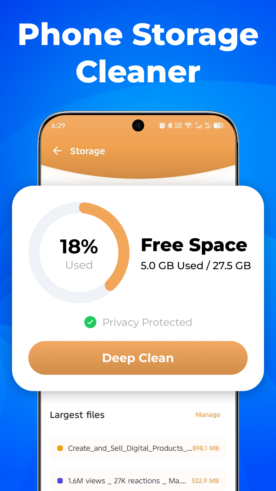
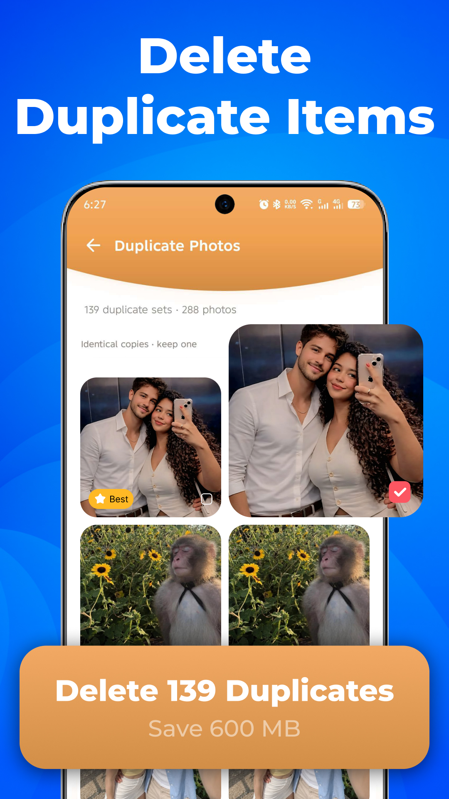
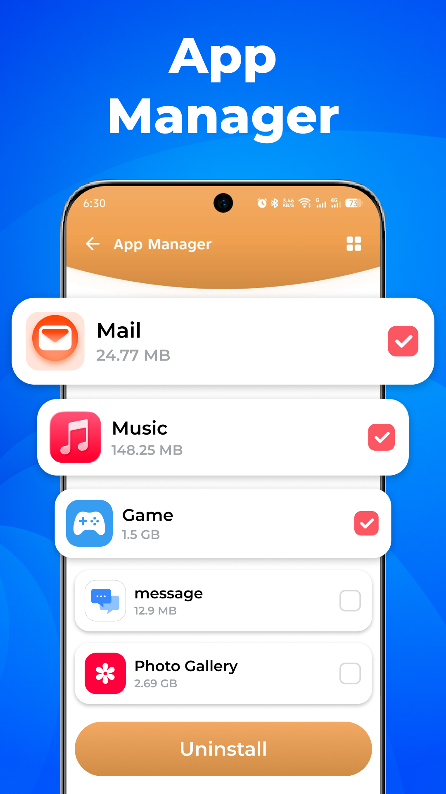

# App Suspension

> **Generated file: do not edit by hand.** Full visible text of the tab as it renders by default, produced by `node tools/export-docs.js`, which GitHub runs after every push.
> Live page: https://zaeem-ahmad-growth.github.io/Phone-Cleaner-Cell-Cave/tabs/01-app-suspension/ · Source: [tabs/01-app-suspension/index.html](../../tabs/01-app-suspension/index.html) · Where each section comes from: [code map](../code-map.md#01-app-suspension)
> Controls on the page (market pickers, version switches, filters, "show more") change the view; this snapshot shows their default state. The data behind every state is in [assets/data.js](../../assets/data.js), described in the [data dictionary](../data-dictionary.md).

Cell Cave · Google Play policy review pack · 9 October 2026

# Phone Cleaner Changes

**Phone Cleaner** (com.clearner.mobilecleaner.filemanager.cloud.savevideo.file.photo) was suspended under the **Deceptive Behavior** policy, Misleading Claims. We accepted the finding, audited our whole listing against it, and corrected everything we found. This page is the evidence: what changed, and the screen in our app behind every claim we still make.

**12** · corrections made to the listing · **15 of 23** · claims proved by an in-app screenshot · **5 of 5** · store screenshots replaced from the submitted build

<a id="request"></a>

1 · our request

## Humble Request to Google Review Team

We are a small, new developer team, and we are writing to ask for your help rather than to dispute your decision. We have corrected everything in our listing that we were able to identify ourselves, and we would be grateful for your guidance on anything we have missed.

**Request sent to the Google Play review team** · Cell Cave

```
Subject: Request for specific guidance - Phone Cleaner
(com.clearner.mobilecleaner.filemanager.cloud.savevideo.file.photo)

Dear Google Play Review Team,

Thank you for your review and for naming Misleading Claims.

We are a new developer account and a small team; this app is many months of
our work. We are not disputing your decision - we are asking for your
support. A suspension this early risks every other app on this account.

We have corrected everything we could find and published every claim beside
the app screen that performs it:

https://zaeem-ahmad-growth.github.io/Phone-Cleaner-Cell-Cave/

If it meets the policy, we would be very grateful to have it reinstated
rather than republished. If not, we would be grateful to know which element
is at fault - title, description, screenshot, icon or graphic - and what it
should say, or which feature is functionally impossible.

Please do take a quick look at what we have put right: the link above opens
it, and a few minutes of your time would show how seriously we take this.
We will do whatever you ask, however much work it takes.

Kind regards,
Cell Cave
```

What we are hoping for

- That this package may be **reinstated with the corrected listing** in section 3, rather than our publishing the app again under a different package name.
- If something still falls short, that we might be told **which element is at fault** — and what it would need to say instead.
- If any feature we describe is held to be **functionally impossible**, that we might know which one, so we can correct it or remove it.

A single sentence on any of these would be enough for us, and we will do whatever you ask, however much work it takes.

Why we would like to correct this app rather than replace it

- The finding was about our store listing, and we have corrected it. **A new package would carry the same app and the same metadata**, so nothing would actually be put right by the move.
- We would **rather repair this where it went wrong** than publish around it.
- A new package would leave the suspension unresolved on our account. We would prefer to close it properly, for your records and ours.

<a id="changes"></a>

2 · what changed

## The suspended listing and the corrected one, field by field

Every correction we made, and nothing else. Claims that were already accurate are proved against the app in [section 4](#proof).

| Field | Suspended listing | Corrected listing | Action |
| --- | --- | --- | --- |
| **Title** | Phone Cleaner: Free Up Space | Phone Cleaner: Junk & Photos | Changed |
| **Short description** | Junk cleaner to remove duplicate photos, clear app cache & free up space. | Junk cleaner for duplicate photos, large files, app cache & storage space. | Changed |
| **"Social Media Folder Cleanup"** | A whole block describing messenger and social-folder cleanup | Removed in full. Those folders are cleaned within general cleanup; we do not ship it as a feature. | Removed |
| **"Duplicate audio tracks"** | Listed among the media the app removes | Removed. The app does not do this. | Removed |
| **Self-asserted compliance** | Two sentences stating the app follows developer policy and avoids false claims | Both deleted. The screens make the argument instead. | Removed |
| **"Compare photos side-by-side"** | Described a side-by-side comparison | "Preview every copy before anything is deleted" — what the screen does | Reworded |
| **"Obsolete APK files, temporary logs"** | An itemised breakdown the screen does not show | "Cache and residual files" | Reworded |
| **Ads and subscription** | Not mentioned anywhere | Stated plainly: ad-supported, with an optional subscription that removes ads | Added |
| **Recycle Bin** | Not stated | Stated, including that space counts as reclaimed only once the bin is emptied | Added |
| **Nine languages** | Not claimed | Stated, with the two right-to-left layouts | Added |
| **Screenshots** | Three of five carried figures the app does not produce, including one larger than the device's total storage | All five replaced with captures from the submitted build — [section 5](#graphics) | Replaced |
| **Feature graphic** | Carried a name the listing never used | Rebuilt with the app's own name; the three feature callouts are unchanged and all shipped | Replaced |

<a id="listing"></a>

3 · the corrected listing

## Our corrected, policy-compliant metadata

This is the listing we will apply on reinstatement. Every claim in it maps to a screen in [section 4](#proof).

Suspended app title · Phone Cleaner: Free Up Space · Suspended short description · Junk cleaner to remove duplicate photos, clear app cache & free up space.

New · App title · Phone Cleaner: Junk & Photos · New · Short description · Junk cleaner for duplicate photos, large files, app cache & storage space.

New

### Full description

Running out of storage? Phone Cleaner: Junk Clean finds the junk files, duplicate photos and large files taking up room on your phone, shows you exactly what it found, and lets you decide what goes. HOW IT WORKS Scan, review, choose, remove. Every tool lists what it found with file names and sizes before anything happens. You tick what you want gone, and the app reports the exact amount it moved. JUNK AND CACHE Quick clean covers app cache and the common junk folders. Deep clean goes further, into thumbnail caches, leftover installer files and temporary log files in Downloads. You see the amount before you clean and the amount after. DUPLICATE AND SIMILAR PHOTOS Scan your gallery for duplicate photos, similar shots, blurry pictures and screenshots you took once and forgot. Every copy is listed with its thumbnail and file size so you can look through them first, and you choose which one to keep. LARGE FILES AND MEDIA Find the biggest files on your device: videos, old screen recordings and other media that quietly take up gigabytes. Sort by size, see what each one is costing you, and remove what you no longer need. STORAGE ANALYZER A breakdown of what is using your space, by category, across internal storage and SD card, with the largest files listed first. APP MANAGER See your installed apps with the space each one takes, find the ones you have not opened in a long time, and uninstall them. FILE MANAGER Browse, sort and organise your files inside the app. MEDIA TOOLS Compress images to save space without deleting them. NOTHING DISAPPEARS WITHOUT YOUR SAY-SO Everything the app removes goes to a Recycle Bin you can restore from for seven days. Restored files come back exactly as they were. Space counts as reclaimed only once you empty the bin, and the app tells you so on screen. A PRIVATE FOLDER Lock photos, videos and files behind a PIN or your fingerprint, inside the app. EVERYTHING RUNS ON YOUR DEVICE File analysis, duplicate detection and cache scanning all happen on your phone. Your files are not uploaded anywhere. WHY THE APP ASKS FOR FILE ACCESS To find junk, duplicates and large files wherever they are stored, the app needs access to the files on your device. That access is used only to scan, list and remove the files you choose. Permissions are requested when a feature needs them, and the app explains why before asking. NINE LANGUAGES English, Hindi, Arabic, Urdu, Turkish, German, Portuguese (Brazil), Chinese and French, with right-to-left layouts for Arabic and Urdu. WHAT IT COSTS The app is ad-supported. There are at least 25 seconds between full-screen ads and no more than twelve in a session. An optional weekly or monthly subscription removes ads. Download Phone Cleaner: Junk Clean, scan your phone, and choose what to remove.

- **Privacy policy:** [cellcave.github.io/apps/phone-cleaner/privacy/](https://cellcave.github.io/apps/phone-cleaner/privacy/)
- **Revised listing and screenshots:** [Google Drive folder](https://drive.google.com/drive/folders/1ozf395lEoOyuMO35Ljb2CVx-haTaS8XM?usp=sharing) — a suspended app cannot be edited in the Console, so the corrected assets are shared here.
- **App specification, QA history and store graphics:** [App Details](../../tabs/02-app-details)

<a id="proof"></a>

4 · evidence

## Every claim, beside the screen that performs it

Captured from our build on LD Player (Android 9, 720×1280, 320 dpi), 17 Sep 2026. Tap any screen to enlarge.

**23** · listing claims audited · **15** · proved by a screenshot · **6** · reworded to what the screen shows · **2** · removed — not features of our app

### A · Title and short description

Proved

"Junk cleaner for duplicate photos, large files, app cache & storage space"

- Home reads real device storage through StatFs — **5.0 GB of 27.5 GB**, not an invented figure.
- Junk Clean moves the bytes it reports: the result equals the figure on the button, **14.4 MB**.
- **18 tools** in the grid, every one opened in QA with no crash.


**Home**5.0 of 27.5 GB


**Junk result**Matches the button


**All Tools**18 in the grid

### B · Junk, cache and safe deletion

Proved

"Quick clean covers app cache and the common junk folders. Deep clean goes further…"

- With read-only access Junk Clean finds **exactly the app cache**; with full access it completes the scan and moves **16.9 MB** to the Recycle Bin.
- The Clean button **announces the ad** before it plays.
- AI Analyzer reports **121.5 MB reclaimable** — the largest figure our app has produced.
- **Reworded:** "obsolete APK files, temporary logs" → "cache and residual files".


**Junk Clean**Cache found


**Result**16.9 MB moved


**Clean button**Ad announced


**AI Analyzer**121.5 MB

Proved

"Everything the app removes goes to a Recycle Bin you can restore from for seven days"

- Every deletion goes to the bin with a **7-day restore window**.
- A restored file was verified **byte-identical by SHA-256** on the device.
- Each item carries its own permanent-delete control.


**Recycle Bin**SHA-256 identical


**Bin list**Per-item delete

### C · Duplicate photos and large media

Proved

"Scan your gallery for duplicate photos… you choose which one to keep"

- **25 duplicate sets · 54 photos**, grouped as "Identical copies · keep one".
- The detected files are named Screenshot_2026… — duplicates *and* screenshots in one capture.
- Per-file thumbnail, size and checkbox; deletion is confirmed before it runs.
- **Reworded:** "side-by-side" → "preview every copy before anything is deleted".


**Duplicates**25 sets · 54 photos


**Confirm**Before deletion


**Result**Moved to the bin

Proved

"Find the biggest files on your device: videos, old screen recordings and other media"

- Large Files found a **60 MB file** and moved it to the Recycle Bin.
- The same file heads the Storage screen's "Largest files" list at 60.0 MB.
- Screen recordings work in the build; the test device held none, so no capture exists.
- **Removed:** "duplicate audio tracks" — our app does not do this.


**Large Files**60 MB removed


**Access**Asked, then granted

### D · App manager, storage analyzer and file manager

Proved

"See your installed apps with the space each one takes…" · "A breakdown of what is using your space"

- App Manager lists **12 installed apps with sizes** and carries an "unused" filter.
- Storage: ring at **18% used**, 5.0 GB of 27.5 GB, Videos 15.2 MB, Photos 11.4 MB, largest files listed.
- File Manager browses internal storage directly.
- SD-card scanning works in the build; the test device had no card attached.


**App Manager**12 apps, sizes


**Storage**18% used


**File Manager**Internal storage

### E · Social Media Folder Cleanup — removed

Not a feature — removed from the listing

"Target dedicated media folders created by popular messaging and social network apps"

- **No messenger or social tool exists** among our 18 tools, and no such screen was captured.
- Those folders are cleaned within general cleanup, but we described it as a feature, and it is not one.
- The whole block was **removed rather than softened**.

No screen exists · **Nothing to show**Block removed

### F · Privacy and on-device processing

Proved

"File analysis, duplicate detection and cache scanning all happen on your phone"

- Privacy & Security runs a **permission-risk audit** and a clipboard cleaner.
- AI Assistant is on-device; the build contains **no upload path** for user files.
- Ad consent can be reopened from the Me tab at any time.
- Private Vault locks files behind a PIN or biometrics.


**Privacy**Permission audit


**AI Assistant**On-device


**Consent**Changeable


**Vault**PIN-locked

### G · The claims this category usually fakes, and we do not

Proved

- **No fake memory boost.** Phone Boost's own copy tells the user that Android reclaims memory itself.
- **No invented numbers.** CPU Cooler reports real temperature; System Monitor shows RAM 1.2 of 5.8 GB and storage 5.0 of 27.5 GB.
- **No deceptive monetization.** The paywall sells only "No ads", with the plans shown before Continue.
- We still **removed both sentences** that asserted our own compliance — these screens make the point instead.


**Phone Boost**No fake boost


**System Monitor**Real figures


**CPU Cooler**Real temperature


**Paywall**Only "No ads"

### H · Ten features we ship that the listing never claimed

Deceptive Behavior is about a listing that promises more than the app delivers. On these ten, ours did the opposite.


**Recycle Bin**7-day restore


**Private Vault**PIN, biometrics


**AI Assistant**Storage Q&A


**Notifications**Opt-in


**Automation**Scheduled


**Battery Saver**Live status


**Media Tools**Compressor


**System Monitor**CPU, RAM


**CPU Cooler**Real temp


**Phone Boost**Honest copy

### Summary

| Listing block | Claims | Proved | Reworded | Removed |
| --- | --- | --- | --- | --- |
| Title and short description | 5 | 5 | 0 | 0 |
| Junk cleaner & residual files | 3 | 2 | 1 | 0 |
| Duplicate photos & media | 3 | 1 | 2 | 0 |
| Cache cleaner & app manager | 3 | 3 | 0 | 0 |
| Storage analyzer & file manager | 3 | 2 | 1 | 0 |
| **Social media folder cleanup** | 2 | 0 | 0 | **2** |
| Privacy & on-device processing | 2 | 2 | 0 | 0 |
| Why choose / key highlights | 2 | 0 | 2 | 0 |
| Total | 23 | 15 | 6 | 2 |

<a id="graphics"></a>

5 · store graphics

## Store graphics, before and after

What we found when we audited our own store art, and what each asset looks like now. The middle frame in every row is the screen in our app that the asset claims to show.

### Issues Identified

| Asset | Verdict | The problem in one line |
| --- | --- | --- |
| **Screenshot 3** · "Remove Junk With AI" | Critical | Claimed 387.7 GB cleaned on a 27.5 GB device, a 96%→8% storage drop, and "3.2 Hours" saved. |
| **Screenshot 1** · "Phone Storage Cleaner" | Critical | The ring read "85 % Used" beside "5.0 GB Used / 27.5 GB", which is 18%. |
| **Screenshot 2** · "Delete Duplicate Items" | High | Figures far above anything the app had been shown doing, and the totals did not reconcile. |
| **Feature graphic** | Medium | Carried a name the listing never used. Its three feature claims are all real. |
| **Icon** | Low–medium | The shield badge reads as security software, which this app is not. |
| **Screenshot 4** · "App Manager" | Acceptable | Placeholder app names, but the feature and the interaction are genuine. |
| **Screenshot 5** · "Helpful Tools" | Good | A real capture of the real screen. The standard the other four were rebuilt to. |

All three claims verified

### Feature graphic

- The defect was the **name on the artwork**, not the claims: it read as a different app from the one being advertised.
- Large Files, Duplicate Photos and the Private Vault are **all shipped**, each captured below.
- **Rebuilt** with the app's own name; callouts unchanged; no figure, percentage, badge or price added.

Store listing


**"Phone Junk Cleaner"**A name the listing never used

Updated store listing


**Rebuilt artwork**The app's own name, same three real features

The app · Each of the three callouts, in the screen that performs it


**Large Files**60 MB moved to the bin


**Duplicate Photos**25 sets, 54 photos


**Private Vault**PIN and biometrics

Was contradicted — now corrected

### Screenshot 1 · Storage

- The ring read **85 % Used** beside **5.0 GB of 27.5 GB**, which is 18.2%. Only the percentage had been altered; the GB figures were the real ones.
- **Recaptured** from the submitted build at the device's real **18%**, so the ring and the GB figures now agree.
- The largest-files list below it now shows real files at real sizes.

Store listing


**"85 % Used"**

The app


**"18% used"**

Updated store listing



**"18% Used"**

Was unsupportable — now rebuilt

### Screenshot 3 · Junk cleaning result

- **387.7 GB** on a 27.5 GB device — 14.1× the whole phone. Our app's real result screen reports 16.9 MB moved to the bin.
- The **96% → 8%** before-and-after and the **"3.2 Hours" saved** were both **removed entirely**: no screen produces the first, and the app has no clock to measure the second.
- **Rebuilt** on the app's real AI Assistant result screen, reporting an amount and a file count the app actually produces.

Store listing


**"387.7GB" · 96%→8%**

The app


**"16.9 MB moved"**

Updated store listing


**"1.2 GB" · 1,248 files**

Figures were unverified — now reconciled

### Screenshot 2 · Duplicate photos

- The header read **235 photos / 2.4GB** while the button offered to delete **147** of them and save that same 2.4 GB. The totals could not both be right.
- **Recaptured:** 139 duplicates out of 288 photos, saving 600 MB — one copy kept per set, which is what the app does.
- The grouping label now reads **"Identical copies · keep one"**, word for word as the app shows it.

Store listing


**"235 photos / 2.4GB"**

The app


**"25 sets · 54 photos"**

Updated store listing



**"139 sets · 288 photos"**

Verified — kept unchanged

### Screenshots 4 and 5 · App Manager and Helpful Tools

- **App Manager** matches the build: apps listed with sizes, multi-select, uninstall. The app names are deliberate placeholders, so no other company's brand or icon appears in our listing.
- **Helpful Tools** is a real capture: six tiles are word-for-word identical to the build and the other two sit below the fold of the capture.
- Neither needed a change, and neither was changed.

Screenshot 4 · App Manager



**Kept**Placeholder names, abstract icons

Screenshot 5 · Helpful Tools


**Kept**Tile for tile, as in the app

### Verification summary

| Asset | What the audit found | What we did |
| --- | --- | --- |
| Screenshot 1 · Storage | Contradicted by the build and by itself | Recaptured at the real 18% |
| Screenshot 3 · Junk with AI | Figures the app cannot produce | Rebuilt; before/after and time-saved claims removed |
| Screenshot 2 · Duplicates | Design matched, figures inflated | Recaptured; totals now reconcile |
| Screenshot 4 · App Manager | Feature verified | Kept; icons kept abstract |
| Screenshot 5 · Tools | Word-for-word match | Kept unchanged |
| Feature graphic | All 3 claims verified · name mismatch | Rebuilt with the app's own name |
| Icon | Shield reads as security software | Under review for the next release |

<a id="appeal"></a>

6 · reference

## The notice, our appeal, and Google's response

The correspondence this page answers, for anyone who needs it.

**Appeal text** · Submitted by Cell Cave

```
Hello,

Thank you for the review and for naming the area.

We respect the Deceptive Behavior policy and have checked our whole listing
against it, correcting what fell short.

We cannot edit a suspended app in the Console, so our revised listing and
screenshots are here:
https://drive.google.com/drive/folders/1ozf395lEoOyuMO35Ljb2CVx-haTaS8XM?usp=sharing

What changed:
- Title is now "Phone Cleaner: Junk & Photos". Existing title "Free Up Space" described
  reclaiming existing storage, not adding capacity, but we removed it.
- Removed "Social Media Folder Cleanup". Those folders are cleaned within
  general cleanup, never as a feature. Duplicate audio is not handled.
- Removed claims about our compliance.
- Stated that the app is ad-supported.
- Replaced all screenshots with App's UI captures from the submitted build.

Every remaining claim matches a feature in the app. We will apply this on
reinstatement and will gladly make any further change you need.

Please tell us if you need anything else.
```


**Suspension notice — open the full screenshot** · Google Play, 7 Oct 2026 · area found: Title (en-US) · opens in a new tab

Appeal declined

### Google's response to our appeal

During review, we found that your app violates the Misleading Claims of Deceptive Behavior policy: We don't allow apps that attempt to deceive users or enable dishonest behavior including but not limited to apps which are determined to be functionally impossible. We don't allow apps that contain false or misleading information or claims, including in the description, title, icon, and screenshots. Apps that advertise a certain functionality in their title must provide the user with that functionality.

Quoted from Google Play's response to our appeal

Our corrected title, **Phone Cleaner: Junk & Photos**, names only the two screens the app opens on — both proved in [section 4](#proof).

### The policy text quoted in the suspension email

We don't allow apps that attempt to deceive users or enable dishonest behavior including but not limited to apps which are determined to be functionally impossible. Apps must provide an accurate disclosure, description and images/video of their functionality in all parts of the metadata. Apps must not attempt to mimic functionality or warnings from the operating system or other apps. Any changes to device settings must be made with the user's knowledge and consent and be reversible by the user.

Quoted in the suspension email, 7 Oct 2026

We treated the second sentence — accurate disclosure "in all parts of the metadata" — as the one that applies, and audited every field against it rather than the title alone.

**Policy sources.** Google Play Console Help: Deceptive Behavior ([17006354](https://support.google.com/googleplay/android-developer/answer/17006354), [9888077](https://support.google.com/googleplay/android-developer/answer/9888077)), Store listing and promotion ([9898842](https://support.google.com/googleplay/android-developer/answer/9898842)), store-listing best practice ([13393723](https://support.google.com/googleplay/android-developer/answer/13393723)), All files access ([10467955](https://support.google.com/googleplay/android-developer/answer/10467955)), enforcement process ([9899234](https://support.google.com/googleplay/android-developer/answer/9899234)), appeals ([2477981](https://support.google.com/googleplay/android-developer/answer/2477981)). All read 7 Oct 2026. Policy quotations were captured through text extraction and are near-verbatim.

**App evidence.** Our QA round of 17 Sep 2026 on LD Player, Android 9, 360×640 dp. The app screenshots on this page are that round's captures, from the real build. The submitted APK is later than that build, so anything sent to Google as evidence is recaptured from the submitted APK first.

**Contact.** Cell Cave · [privacy policy](https://cellcave.github.io/apps/phone-cleaner/privacy/). This page is maintained by the developer and is published for the Google Play review team.
