# App Details

> **Generated file: do not edit by hand.** Full visible text of the tab as it renders by default, produced by `node tools/export-docs.js`, which GitHub runs after every push.
> Live page: https://zaeem-ahmad-growth.github.io/Phone-Cleaner-Cell-Cave/tabs/02-app-details/ · Source: [tabs/02-app-details/index.html](../../tabs/02-app-details/index.html) · Where each section comes from: [code map](../code-map.md#02-app-details)
> Controls on the page (market pickers, version switches, filters, "show more") change the view; this snapshot shows their default state. The data behind every state is in [assets/data.js](../../assets/data.js), described in the [data dictionary](../data-dictionary.md).

Android app · App details · com.clearner.mobilecleaner.filemanager.cloud.savevideo.file.photo

# Phone Cleaner: Junk & Photos

Scan for junk, large files and duplicate photos, move them to a 7-day Recycle Bin, and manage apps, files and a private vault — in 9 languages.

Version · **1.0.0 (1)** · Runs on · **Android 7.0+** · Languages · **9** · Tools · **18** · Developer · **Cell Cave**

### Clean

- Junk clean (quick and deep)
- Large files, duplicate photos, screenshots
- Recycle Bin with 7-day restore

### Speed up

- Phone boost, CPU cooler, battery saver
- Live system monitor
- AI analyzer and storage assistant

### Protect

- Private vault with PIN and biometrics
- Permission-risk audit, clipboard cleaner
- Notification cleaner (opt-in)

### Manage

- File manager and app manager
- Image compressor
- Scheduled auto-clean

Spec

## Spec

Read from the submitted APK.

Identity

- **Name**: Phone Cleaner: Junk & Photos
- **Package**: com.clearner.mobilecleaner.filemanager.cloud.savevideo.file.photo
- **Developer**: Cell Cave
- **Version**: 1.0.0 (versionCode 1)
- **Play listing**: suspended on Google Play, 7 Oct 2026

Platform

- **Runs on**: Android 7.0 and later
- **UI**: Jetpack Compose, Material 3, single Activity
- **ABIs**: arm64-v8a, armeabi-v7a, x86, x86_64
- **Tools in the app**: 18

Languages (706 strings each, 0 missing)

English · हिन्दी · العربية · RTL · اردو · RTL · Türkçe · Deutsch · Português (BR) · 中文 · Français

Every user-visible string is translated in all nine locales, with no missing entries and no hardcoded text.

Screens

## Screenshots

Captured from the app on 17 Sep 2026. Captions say what each screen shows.

### First run

fresh install

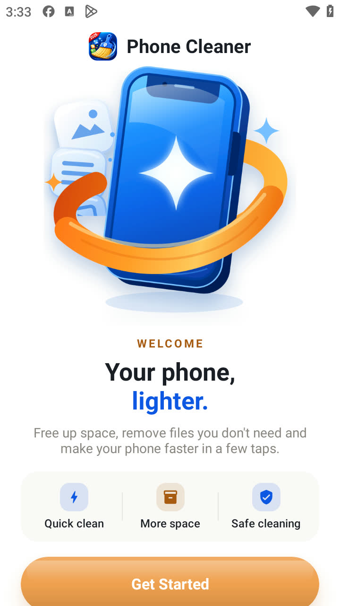

**Splash · ready**Get Started appears once the app has finished starting

**Home**Real storage figures from the device: 5.0 GB used of 27.5 GB

### Cleaning and the Recycle Bin

junk, large files and the 7-day Recycle Bin

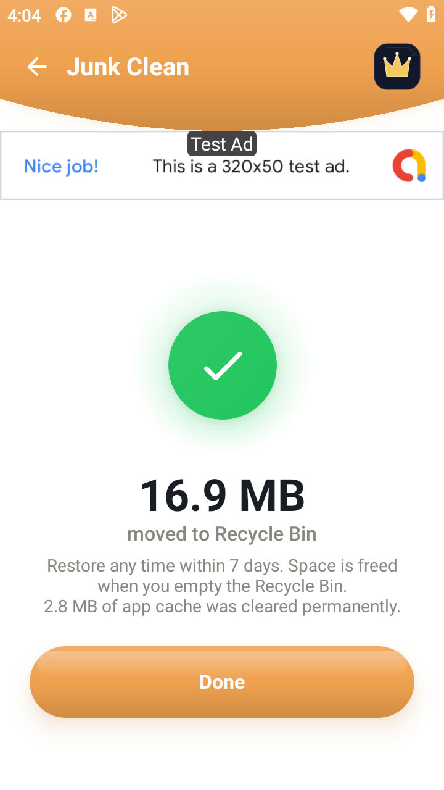

**Junk Clean · result**16.9 MB moved to the Recycle Bin, and the result states the same amount

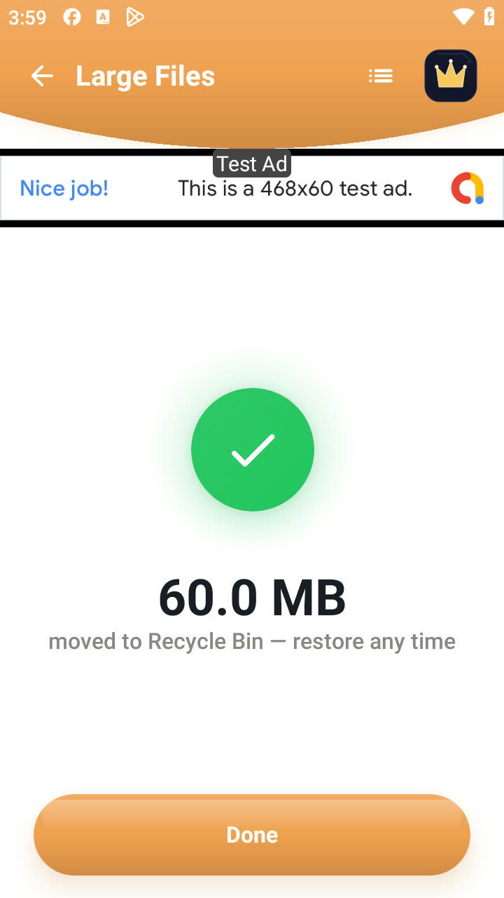

**Large Files · deleted**60 MB file moved to the Recycle Bin

**Recycle Bin**Restored with an identical SHA-256

**Recycle Bin · list**Each item can be restored or deleted for good

### Tools

every tool opened; 0 crashes

**All tools**18 tools in the grid

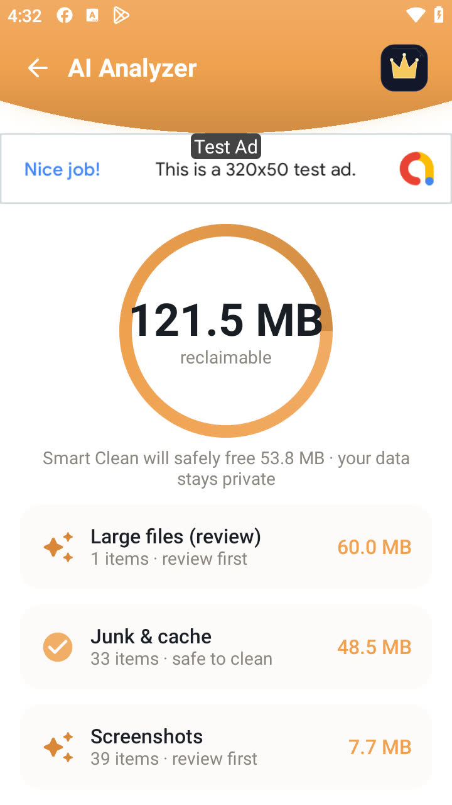

**AI Analyzer**121.5 MB reclaimable, Smart Clean 53.8 MB

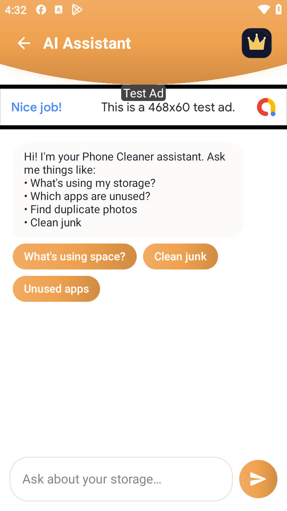

**AI Assistant**On-device storage assistant

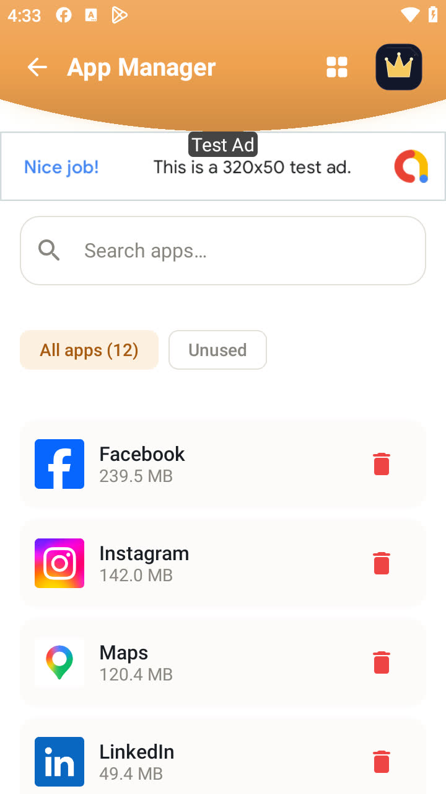

**App Manager**12 apps with sizes; unused filter

**Phone Boost**The screen states that Android reclaims memory itself

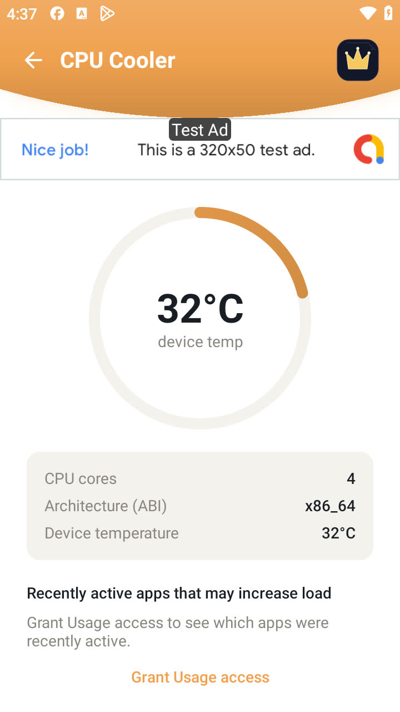

**CPU Cooler**Real temperature and CPU facts

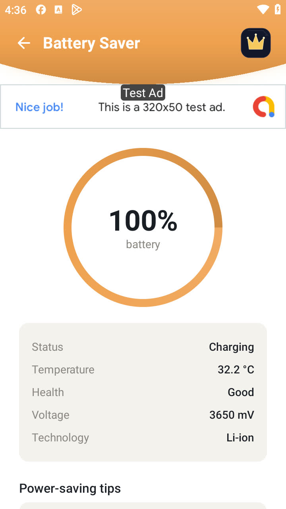

**Battery Saver**Live battery status

**System Monitor**RAM 1.2 of 5.8 GB, storage 5.0 of 27.5 GB

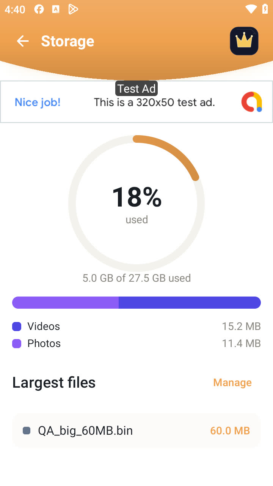

**Storage**Category breakdown from MediaStore

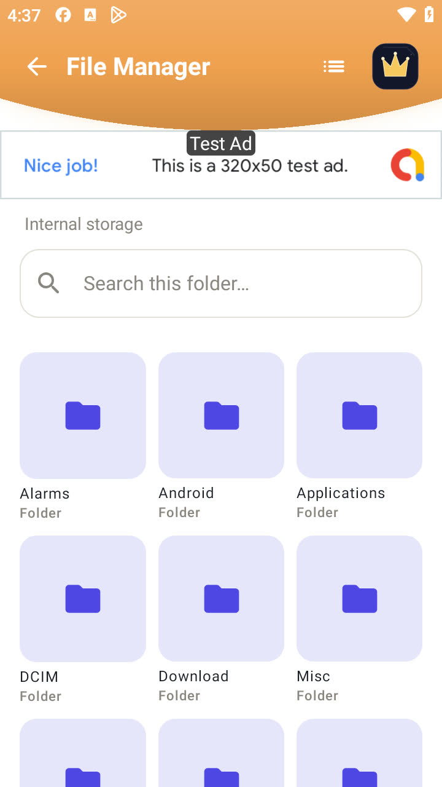

**File Manager**Internal storage browser

**Media Tools**Image compressor with four levels

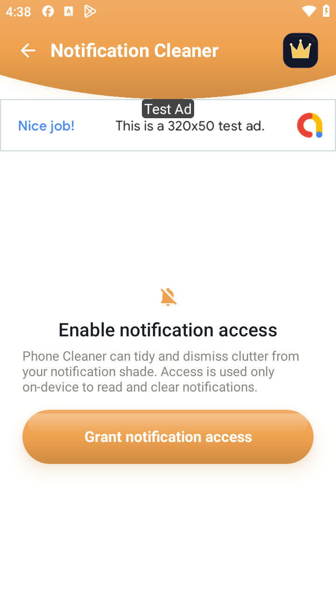

**Notifications**Opt-in notification cleaner

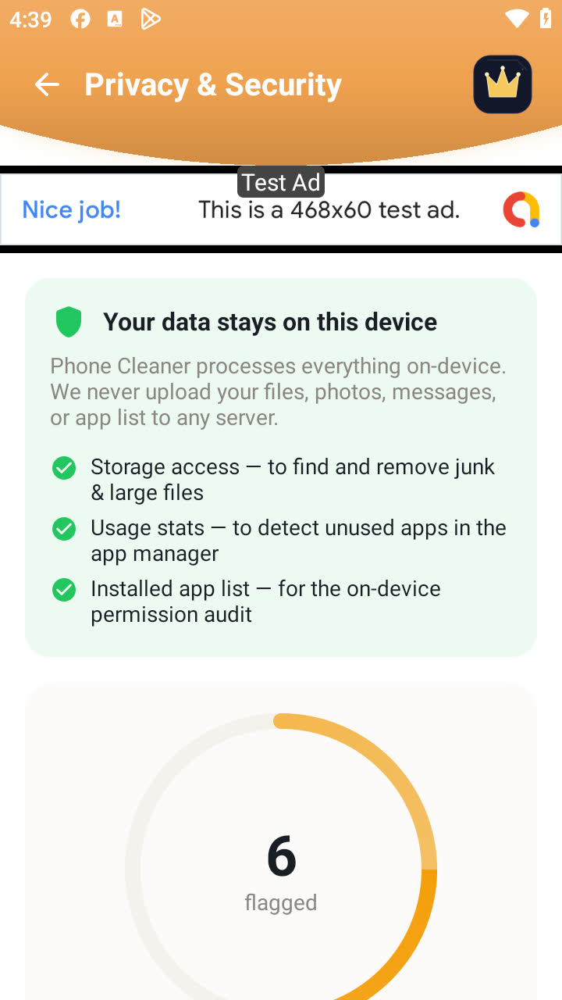

**Privacy & Security**Permission audit and clipboard cleaner

**Automation**Scheduled auto-clean

**Private Vault**A photo hidden and restored

Graphics

## Graphics

The store assets for the listing we will apply on reinstatement: the app icon, the feature graphic and the five screenshots. Every screenshot is a capture of a screen in the app, and the figures on them are figures the app produces.

App icon

512×512 PNG · used on the store listing, in the launcher and as this site's favicon.

Feature graphic

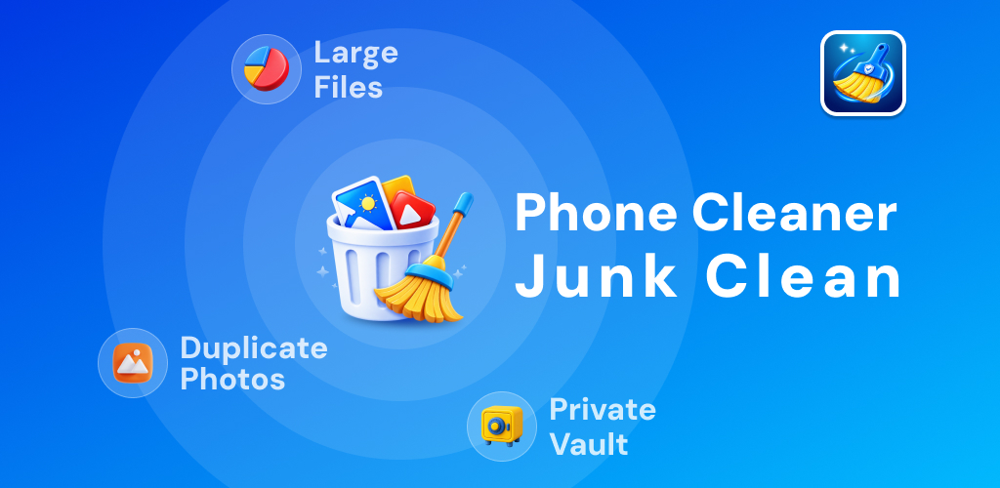

1024×500 · three feature callouts, all three shipped in the app: Large Files, Duplicate Photos and the Private Vault.

Store screenshots · 5

**1 · Phone Storage Cleaner**Storage ring at the device's real 18% used, 5.0 GB of 27.5 GB, with the largest files below.

**2 · Delete Duplicate Items**Grouped identical copies, one kept per set, with the running total on the delete button.

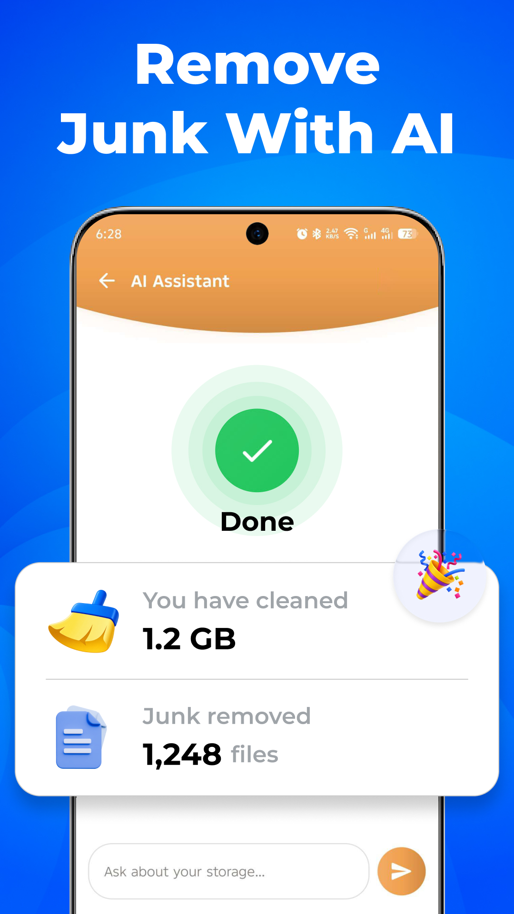

**3 · Remove Junk With AI**The AI Assistant result screen, reporting the amount cleaned and the file count.

**4 · App Manager**Installed apps with their sizes, multi-select and uninstall. App names are placeholders so that no other company's brand or icon appears in our listing.

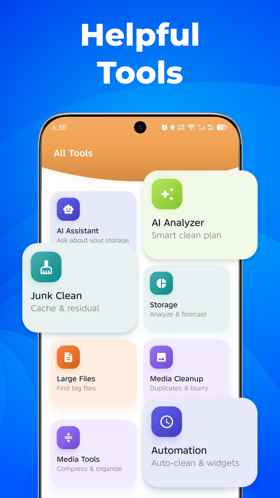

**5 · Helpful Tools**The All Tools grid, tile for tile and subtitle for subtitle as it appears in the app.

Phone Cleaner by Cell Cave · package com.clearner.mobilecleaner.filemanager.cloud.savevideo.file.photo · every figure on this page is one the app itself produces. [Privacy policy](https://cellcave.github.io/apps/phone-cleaner/privacy/).
