# App Details

> **Generated file: do not edit by hand.** Full visible text of the tab as it renders by default, produced by `node tools/export-docs.js`, which GitHub runs after every push.
> Live page: https://zaeem-ahmad-growth.github.io/Phone-Cleaner-Cell-Cave/tabs/02-app-details/ · Source: [tabs/02-app-details/index.html](../../tabs/02-app-details/index.html) · Where each section comes from: [code map](../code-map.md#02-app-details)
> Controls on the page (market pickers, version switches, filters, "show more") change the view; this snapshot shows their default state. The data behind every state is in [assets/data.js](../../assets/data.js), described in the [data dictionary](../data-dictionary.md).

Android app · App details · com.clearner.mobilecleaner.filemanager.cloud.savevideo.file.photo

# Phone Cleaner & Clear Junk

Scan for junk, large files and duplicate photos, move them to a 7-day Recycle Bin, and manage apps, files and a private vault — in 9 languages.

QA score · 17 Sep 2026 · **84** / 100 · Started at 69 · 23 of 24 bugs fixed, 1 open · Target line at 90

Version · **1.0.0 (1)** · Runs on · **Android 7.0+** · Languages · **9** · Tools · **18** · Debug APK · **29.6 MB**

### Clean

- Junk clean (quick and deep)
- Large files, duplicate photos, screenshots
- Recycle Bin with 7-day restore

### Speed up

- Phone boost, CPU cooler, battery saver
- Live system monitor
- AI analyzer and storage assistant

### Protect

- Private vault with PIN and biometrics
- Permission-risk audit, clipboard cleaner
- Notification cleaner (opt-in)

### Manage

- File manager and app manager
- Image compressor
- Scheduled auto-clean

### Checked on the test device

17 Sep 2026 · LD Player · Android 9 · 360×640 dp · after the fix round

Duplicate photos · one file under two paths is not a copy (C1)

Android 9 storage access · one dialog grants read and write (H1)

Recycle Bin restore · SHA-256 and date kept, also off primary storage

Vault PIN with 0 · created and unlocked on 640 dp

Rewarded ad announced on the Clean button

Urdu sizes · 5.1 GB, not GB 5.1

Privacy options · consent changed from Me

Hosted privacy policy · still the old text (H5)

One emulator only. Android 10+ keep-data prompt, Android 11+ storage and 13+ permission behaviour were not run on a device.

Spec

## Spec

Read from the installed APK (aapt2) and the build files on branch Development/muzammal_dev_1.0.0 at 4d53bef plus the uncommitted fix round of 17 Sep.

Identity

- **Name**: Phone Cleaner & Clear Junk
- **Package**: com.clearner.mobilecleaner.filemanager.cloud.savevideo.file.photo
- **Source namespace**: com.purespace.cleaner
- **Version**: 1.0.0 (versionCode 1)
- **Play listing**: suspended on Google Play, 7 Oct 2026

Platform

- **min / target / compile SDK**: 24 / 36 / 36
- **UI**: Jetpack Compose, Material 3, single Activity
- **Architecture**: MVVM, ViewModel + StateFlow, no DI framework
- **ABIs**: arm64-v8a, armeabi-v7a, x86, x86_64
- **Release build**: R8 minify + resource shrink; 8.0 MB unsigned (9 Sep)

Toolchain

- **AGP**: 8.7.3
- **Gradle**: 8.11.1
- **Kotlin**: 2.0.21
- **Compose BOM**: 2024.12.01
- **JDK**: 17 (toolchain)

Key libraries

- **Google Mobile Ads**: 24.4.0
- **User Messaging Platform**: 3.2.0
- **Play Billing**: 7.1.1
- **Firebase BOM**: 33.7.0 (Analytics, Crashlytics, Remote Config, Messaging, Performance)
- **WorkManager**: 2.10.0
- **Coil (+video)**: 2.7.0
- **Biometric**: 1.1.0
- **Lottie**: 6.6.2

Permissions in the APK

MANAGE_EXTERNAL_STORAGE

QUERY_ALL_PACKAGES

PACKAGE_USAGE_STATS

KILL_BACKGROUND_PROCESSES

REQUEST_DELETE_PACKAGES

READ_EXTERNAL_STORAGE ≤32

WRITE_EXTERNAL_STORAGE ≤28

READ_MEDIA_IMAGES / VIDEO

POST_NOTIFICATIONS

USE_BIOMETRIC

AD_ID

BILLING

RECEIVE_BOOT_COMPLETED

FOREGROUND_SERVICE (WorkManager)

MANAGE_EXTERNAL_STORAGE and QUERY_ALL_PACKAGES need Play Console declarations. Only MainActivity is exported in the release APK; debuggable is off there.

Languages (706 strings each, 0 missing)

English · हिन्दी · العربية · RTL · اردو · RTL · Türkçe · Deutsch · Português (BR) · 中文 · Français

Checked with a Compose-aware scan: no missing strings, no format-argument mismatches, no hardcoded user-visible text. The privacy-policy screen strings are English in every locale.

Versions

## Versions & APK

1. 17 Sep 2026 · 1.0.0 1 · QA fix round (uncommitted, on top of 4d53bef): 22 of the 23 audit findings and one new regression finding (L7) fixed and verified on LD Player — duplicate same-file guard, Android 7–10 storage access, honest paywall, announced rewarded ad, privacy options, recycle bin on the file's own storage, first-run layouts for small screens, plurals and RTL sizes.
2. 17 Sep 2026 · 1.0.0 1 · Audited build: startup progress bar (4d53bef), ad preloading, UMP consent, two-slot App Open and the Firebase suite (6389a93), deprecation cleanup (5352822). versionCode has not changed since the first commit.
3. 3 Aug 2026 · 1.0.0 1 · Initial commit of the PureSpace cleaner (aa18e45).

Build installed for the fix round

CleanStorageMobile/app/build/outputs/apk/debug/app-debug.apk

- **Variant**: debug (test ads, Remote Config off, Crashlytics/Analytics collection off)
- **Size**: 29.6 MB (28.2 MiB) · debug
- **Built**: 17 Sep 2026 18:32 from 4d53bef + fix round (uncommitted)
- **Installed**: 17 Sep 2026 18:33 on LD Player (emulator-5554), install -r
- **Audited build**: 29.5 MB, 11 Sep, sha256 3307b0a2…

SHA-256

9c1c2aa13469bcf4e97ad3150a63f2824f6a115bb24b23f33a518341aa09a0ec

**Before a Play upload:** real AdMob app id and 15 unit ids in Remote Config (including the new MC_resume_appopen pair), a signing key, the new privacy policy text on the hosted page (H5), the two permission declarations, and a release smoke test on a phone.

Earlier builds

- **Release APK, unsigned · 8.0 MB**: 9 Sep 2026 · not installed

Screens

## Screenshots

Captured on LD Player (Android 9, 720×1280, 320 dpi) on 17 Sep 2026 with Google test ads. Captions say what each screen proves.

### First run

fresh install · 360×640 dp · test ads

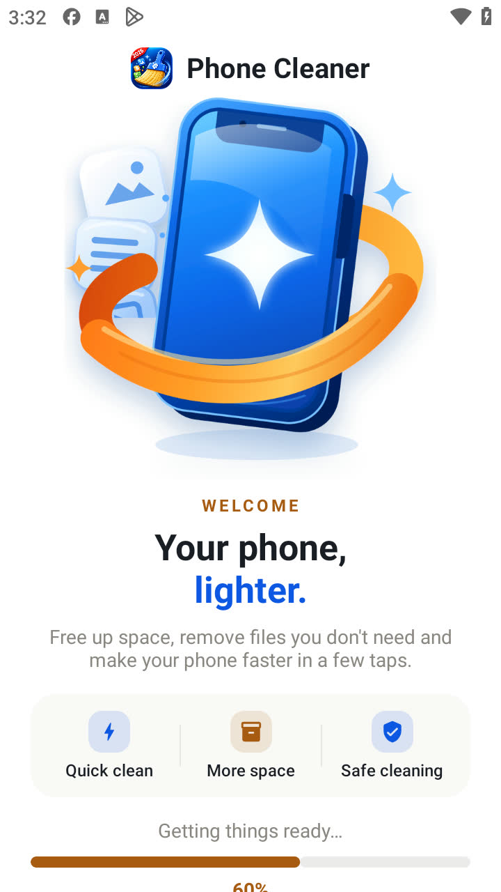

**Splash · startup bar**The new progress bar at 60% while consent and the ad SDK settle

**Splash · ready**Get Started replaces the bar once every step has an answer

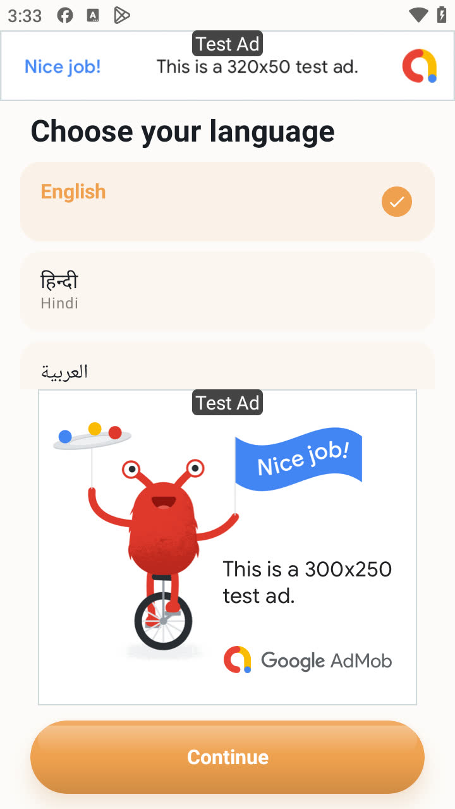

**Language picker**2½ of 9 languages visible; the MREC ends 12 dp above Continue (H4, M2) — before the fix

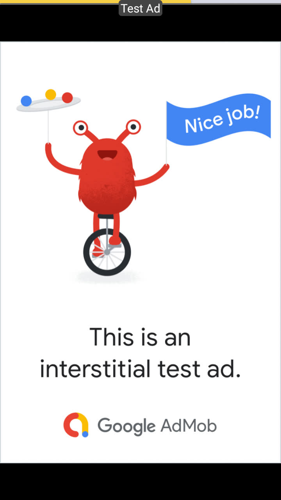

**Interstitial**Language → Onboarding interstitial rendered correctly

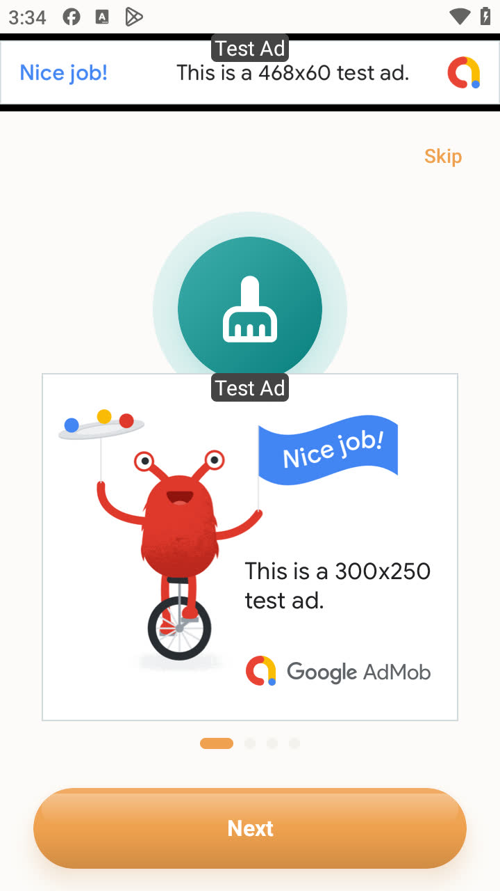

**Onboarding**Only a cropped icon and an ad — the page text never appears (H9) — before the fix

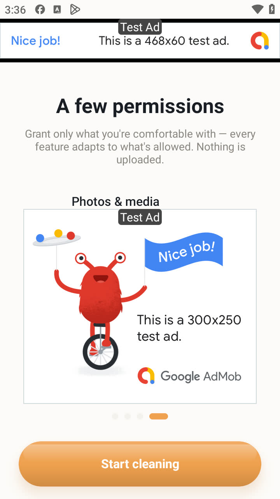

**Permissions page**The Grant button is a 3 px sliver on the MREC edge before scrolling (H4) — before the fix

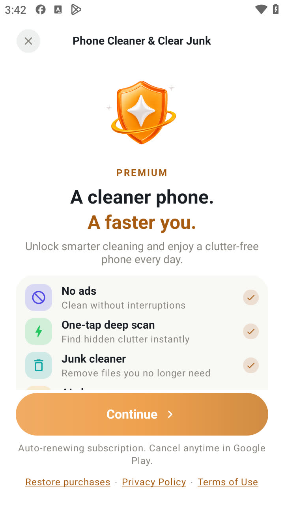

**Paywall**Perks + Continue, no plan or price in the first view (H2, M3) — before the fix

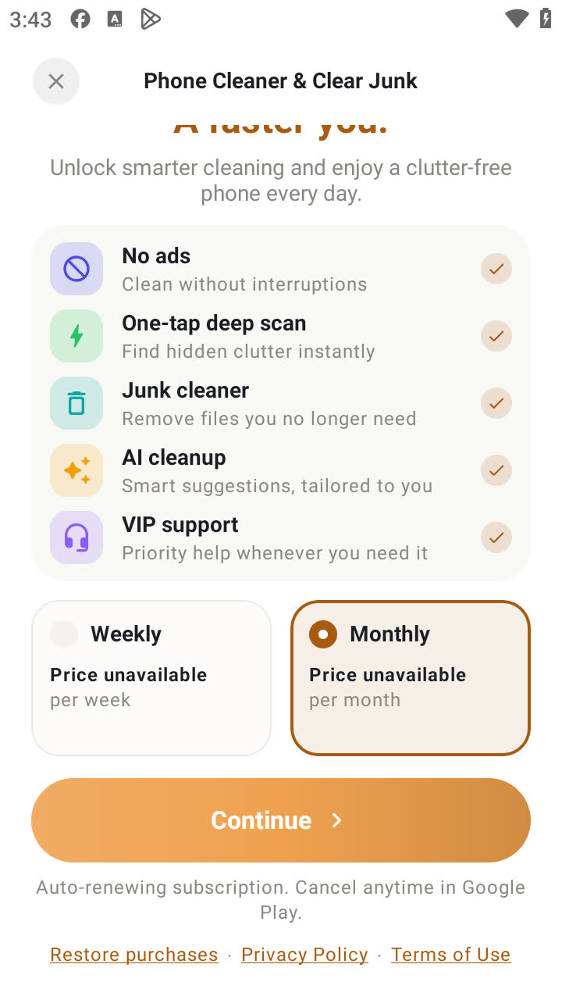

**Paywall · plans**Weekly / Monthly cards below the fold; prices unavailable on the emulator

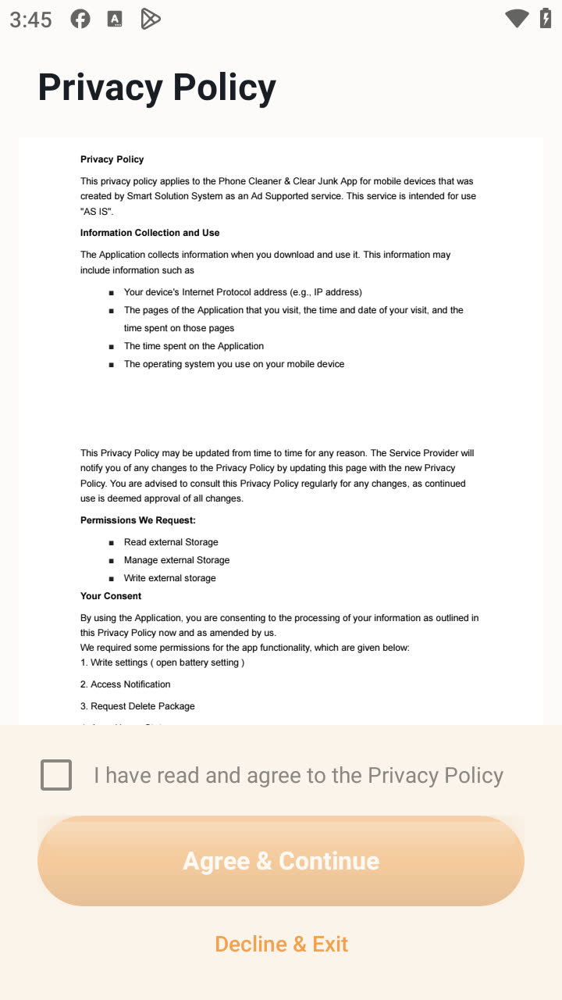

**Privacy consent**The policy is shown as images; Agree stays disabled until the box is ticked (M4) — before the fix

**Home**Real storage figures (StatFs): 5.0 GB used of 27.5 GB

### Cleaning and the Recycle Bin

Android 9 · before and after full storage access

**Junk Clean · read access only**Finds only the app cache; asks for access the app never requests (H1) — before the fix

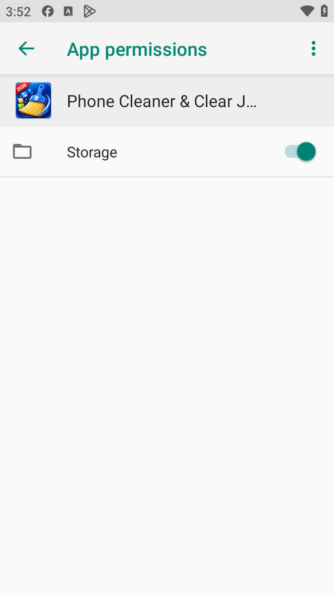

**App Info**Where "Grant access" leads: Storage already ON, nothing to switch (H1) — before the fix

**Large Files · gated**The whole tool is locked behind the same dead end (H1) — before the fix

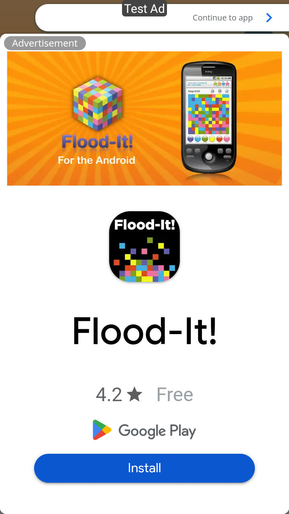

**App Open on return**The resume ad fires after the app’s own settings link (M1) — before the fix

**Junk Clean · result**After granting: 16.9 MB moved to the bin, honest wording about freed space

**Large Files · deleted**60 MB file moved to the Recycle Bin

**Recycle Bin**Restored with an identical SHA-256

**Recycle Bin · list**Per-item delete forever; the icon target is 24 dp

**Duplicate Photos**25 sets of our own screenshots pre-ticked — one file under two paths (C1) — before the fix

**Duplicate delete · confirm**Deleting the "copy" of a file indexed twice

**Duplicate delete · result**Both paths were gone afterwards; the kept row is a ghost (C1) — before the fix

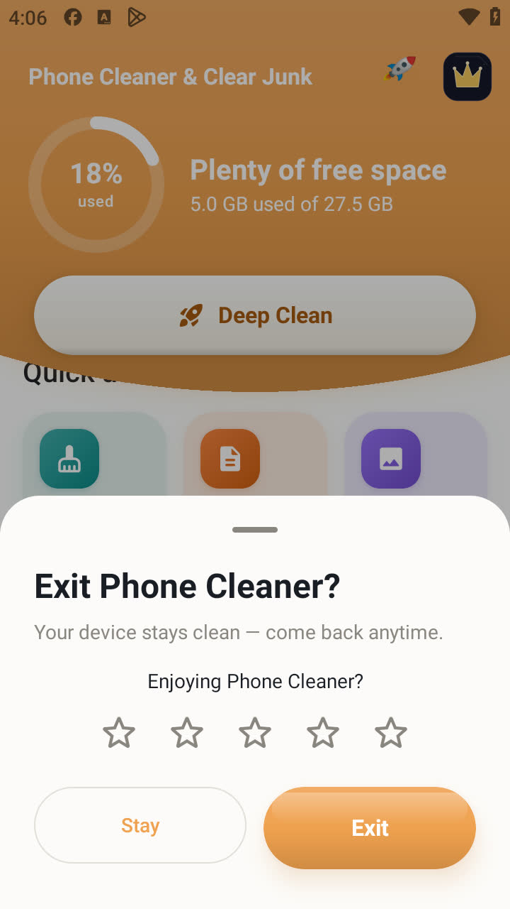

**Exit sheet**Rating prompt: 4–5 stars to Play, 1–3 to email (RG1, our product decision)

### Tools

every tool opened; 0 crashes

**All tools**18 tools in the grid

**AI Analyzer**121.5 MB reclaimable, Smart Clean 53.8 MB

**AI Assistant**On-device storage assistant

**App Manager**12 apps with sizes; unused filter

**Phone Boost**Honest copy: Android reclaims memory itself

**CPU Cooler**Real temperature and CPU facts

**Battery Saver**Live battery status

**System Monitor**RAM 1.2 of 5.8 GB, storage 5.0 of 27.5 GB

**Storage**Category breakdown from MediaStore

**File Manager**Internal storage browser

**Media Tools**Image compressor with four levels

**Notifications**Opt-in notification cleaner

**Privacy & Security**Permission audit and clipboard cleaner

**Automation**Scheduled auto-clean

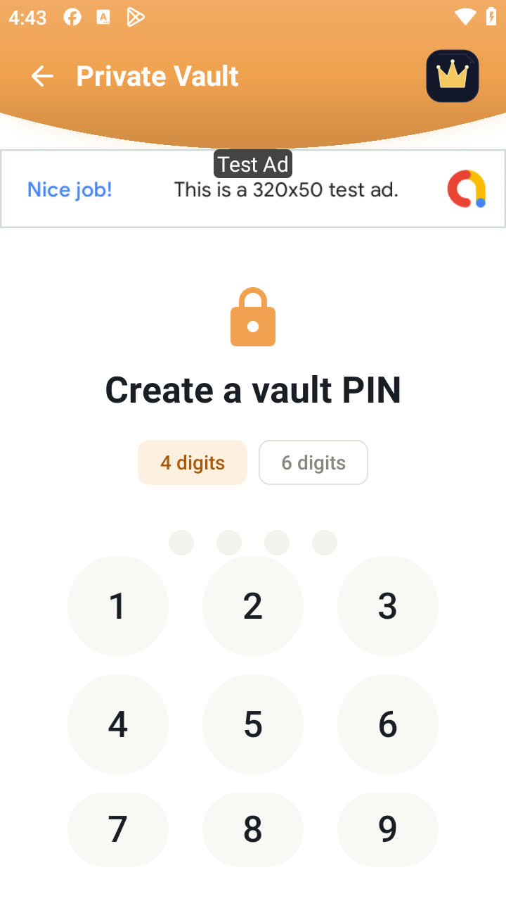

**Private Vault · PIN**The 0 and delete keys are below the screen and it does not scroll (H10) — before the fix

**Private Vault**A photo hidden and restored; stored unencrypted in app storage

Graphics

## Graphics

The store assets for the listing we will apply on reinstatement: the app icon, the feature graphic and the five screenshots. Every screenshot is a capture of a screen in the app, and the figures on them are figures the app produces.

App icon

512×512 PNG · used on the store listing, in the launcher and as this site's favicon.

Feature graphic

1024×500 · three feature callouts, all three shipped in the app: Large Files, Duplicate Photos and the Private Vault.

Store screenshots · 5

**1 · Phone Storage Cleaner**Storage ring at the device's real 18% used, 5.0 GB of 27.5 GB, with the largest files below.

**2 · Delete Duplicate Items**Grouped identical copies, one kept per set, with the running total on the delete button.

**3 · Remove Junk With AI**The AI Assistant result screen, reporting the amount cleaned and the file count.

**4 · App Manager**Installed apps with their sizes, multi-select and uninstall. App names are placeholders so that no other company's brand or icon appears in our listing.

**5 · Helpful Tools**The All Tools grid, tile for tile and subtitle for subtitle as it appears in the app.

QA history

## QA history

One ledger (bugs.json) drives every count and the score. Severity: critical = data loss or a broken core flow; high = a core flow that fails for some users, or a policy risk.

Bugs found · **24** · Across 2 QA rounds, 17 Sep 2026 · LD Player (Android 9) · audit on 4d53bef, fixes verified on 91609879 and 9c1c2aa1 · 1 product-decision item not counted

Fixed · **23** · 96% fix rate · all verified on a device

Still open · **1** · 0 critical, 1 high, 0 medium, 0 low · reasons below

QA score · **84 / 100** · Target 90 · started at 69

Fixed vs open · all rounds · 23 fixed · 1 open · Fixed 23 · Open 1 · Open bugs by severity · Critical · **0** · High · **1** · Medium · **0** · Low · **0** · Not rated · **0**

| QA round | Found | Fixed | Open | Fix rate |
| --- | --- | --- | --- | --- |
| **19-category audit** 17 Sep 2026 · LD Player (Android 9) · debug build 4d53bef | 23 | 22 | 1 | 96% |
| **Fix round** 17 Sep 2026 · all audit findings fixed and checked on LD Player · new findings from its regression pass | 1 | 1 | 0 | 100% |
| Total | 24 | 23 | 1 | 96% |

### Why 1 bug is still open

Why these are still open

### Hosted on our own website

H5

The in-app policy is fixed and verified. Play Console checks the hosted page, which we update ourselves. The in-app policy is already corrected and verified; the hosted page is published at cellcave.github.io/apps/phone-cleaner/privacy/.

1

Not counted as bugs, by our product decision: **RG1** Exit sheet sends only 4–5 star ratings to Play (explicit product direction: — 4–5 stars open Play, 1–3 open support mail).

QA score · out of 100

Audit, 2026-09-17 · **69**

Fix round, 2026-09-17 · **84**

0 · 50 · 90 target · 100

How the score works: each of the 19 scored categories starts at 100 and loses 25 per open critical, 12 per high, 6 per medium, 2 per low and 4 per unrated bug, 3 per fix not yet checked on a device, and 5 per planned test that could not be run. The total is the average, capped while serious items remain: at most 69 with an open critical, 84 with an open high, 94 with an open medium, 95 with an unrated bug, 98 with an open low, and 99 until every fix is device-checked and every planned test has run. Now: average 98, capped at 84 (1 open high bug).

| Category | Score | Why not 100 |
| --- | --- | --- |
| Functional | 100 | — |
| UI | 100 | — |
| UX | 100 | — |
| Compatibility | 95 | −5 not tested: only one device: LD Player (Android 9, 360x640 dp). Android 11+ scoped storage and All-files access, 13+ media and notification permissions, and 15 edge-to-edge were not run on a device |
| Installation | 100 | — |
| Performance | 95 | −5 not tested: emulator and debug build: startup and jank numbers are indicative, not release figures |
| Load | 100 | — |
| Stress | 100 | — |
| Network | 95 | −5 not tested: LD Player cannot toggle radios without hanging; only the request-failed path (dead proxy) was tested, not "no network" |
| Security | 88 | −12 H5 open (high) |
| Usability | 100 | — |
| Regression | 100 | — |
| Smoke | 100 | — |
| Sanity | 100 | — |
| Interrupt | 95 | −5 not tested: no SIM: incoming call not tested |
| Battery | 95 | −5 not tested: emulator has no real battery; wake locks and Doze not measured |
| Permission | 100 | — |
| Localization | 100 | — |
| Accessibility | 100 | — |

### Fix round · first run on a 360×640 screen

Fixed and checked on the device · 17 Sep

Short screens now get a banner instead of the 250 dp MREC, so the page itself has room and the ad keeps its distance from the buttons.

**M2 · before**2½ languages, MREC 12 dp from Continue

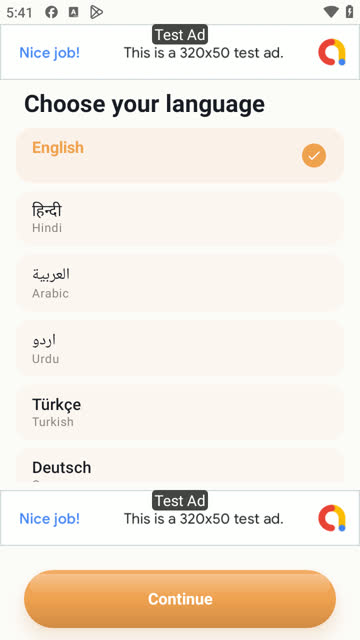

**M2 · after**5½ languages, banner 24 dp from Continue

**H9 · before**Only a cropped icon and an ad

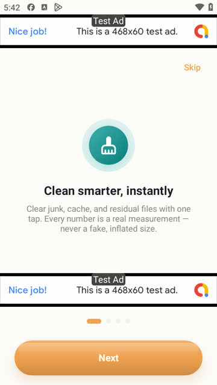

**H9 · after**Title and description on screen

**M3 · before**Continue before any plan or price

**M3 and H2 · after**Plans first; only 'No ads' is sold

| Bug | Before | After |
| --- | --- | --- |
| **H4** Ad to Continue (Language) | 12 dp | 24 dp |
| **H4** Ad to Grant (permissions) | 0 dp, Grant on the ad edge | 12 dp, both rows visible |
| **M2** Languages in view | 2½ of 9 | 5½ of 9 |
| **L3** Startup percentage | cut at the bottom edge | on the label line, fully visible |

Measured with Google test ads on.

### Fix round · data safety

Fixed and checked on the device · 17 Sep

The two data-loss paths are closed, and the Recycle Bin keeps files on their own storage.

**C1 · before**25 sets of one file under two paths, pre-ticked

**H7 · after**Refreshing keeps the user's choices

**H10 · before**0 and delete below the screen

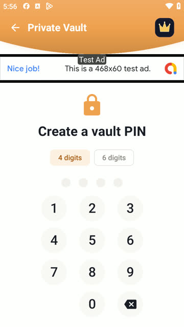

**H10 · after**All keys fit; PIN 1020 created and unlocked

| Check | Before | After |
| --- | --- | --- |
| **C1** File indexed under two paths | listed as a copy; delete removed both | not listed |
| **C1** Duplicate summary | 25 sets · 54 photos | 9 sets · 23 photos |
| **H7** Unticked copy after refresh | ticked again | stays unticked (649.6 KB) |
| **H8** Bin location, file off primary storage | app-private store | hidden bin beside the file |
| **H8** Restored file | new modified time | same SHA-256 and date |

The emptied hidden bin folder stays on LD Player's shared folder, which refuses rmdir from Android; phone storage does not have this limit.

### Fix round · ads, consent and language

Fixed and checked on the device · 17 Sep

Ads are announced, consent can be changed, and sizes read correctly in right-to-left languages.

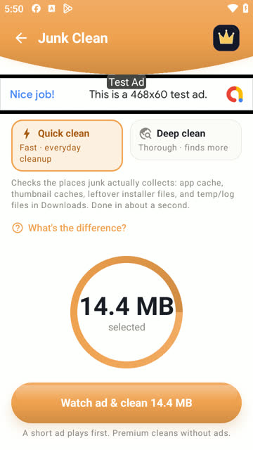

**H3 · after**The button says an ad plays first

**L2 · after**Result equals the button: 14.4 MB

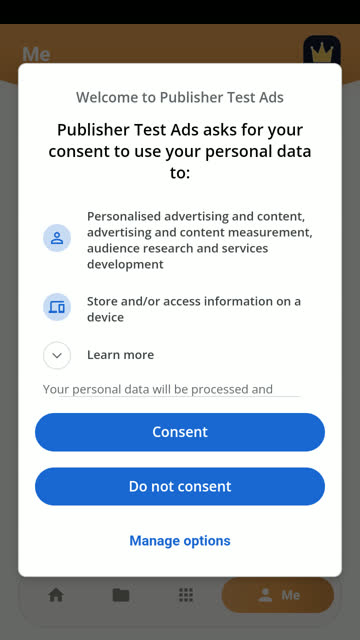

**H6 · after**Consent form opened from Me

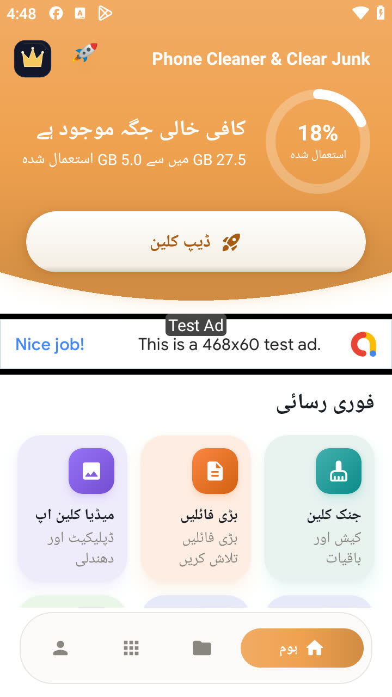

**M5 · before**GB 5.0 in Urdu

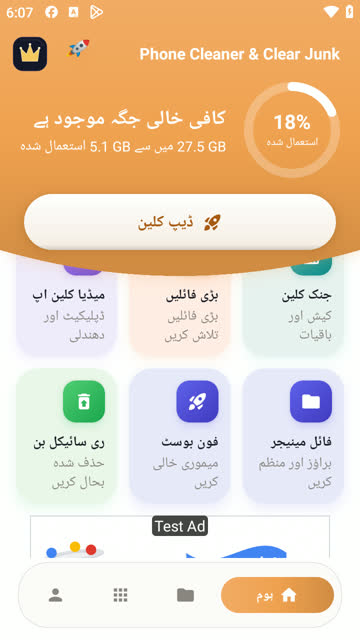

**M5 · after**5.1 GB in Urdu

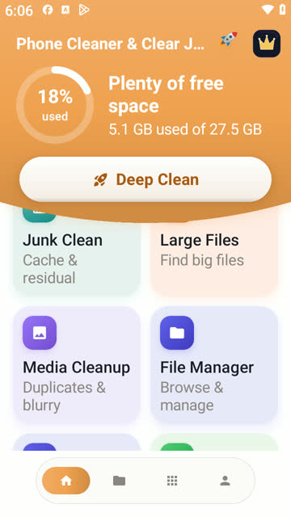

**L4 · after**Two columns at 130% text

| Bug | Before | After |
| --- | --- | --- |
| **M1** Back from Settings the app opened | resume ad shown | skipped (logged); Home key still shows it |
| **L2** Button vs result | Clean 2.5 MB → 4.6 MB freed | Clean 14.4 MB → 14.4 MB cleaned |
| **L2** App cache item | 2.4 MB (mostly the ad WebView) | 39.7 KB |
| **H6** Consent after the first answer | no way to change it | Me › Privacy options |

Privacy options were tested with UMP's debug EEA geography, registered for this emulator in the debug build only.

### C1 · one photo, two paths, both deleted

Reproduced on device · 17 Sep 16:44 · before the fix

One PNG indexed under two paths (same inode). Duplicate Photos called them identical copies, kept one and deleted the other — and both disappeared.

**C1 · before delete**'Identical copies · keep one', second path pre-ticked

**C1 · after delete**'144.7 KB moved to Recycle Bin' — no copy left on disk

| Check | Before delete | After delete |
| --- | --- | --- |
| **/storage/emulated/0/Pictures/QA_alias.png** | present (inode 79) | missing |
| **/mnt/shared/Pictures/QA_alias.png** | present (inode 79) | missing |
| MediaStore row 778 (the 'kept' copy) | valid | points to a missing file |

Recovered from the Recycle Bin afterwards. Our own screenshots on this device are in the same state and are pre-ticked when the screen opens; they were not deleted.

### H1 · Android 9 storage access dead end

Measured on device · 17 Sep · before the fix

With only READ granted, the app keeps asking for All-files access and sends the user to App info, where Storage is already on.

**H1 · READ only**Junk finds only app cache and asks for access

**H1 · 'Grant access'**App info: Storage already on, nothing to switch

**H1 · READ + WRITE**After the hidden off/on toggle: full scan

| Access | Junk scan | Large Files |
| --- | --- | --- |
| READ (what onboarding grants) | App cache 2.4 MB only | locked |
| READ + WRITE (Storage toggled off, then on) | 37 items · 52.2 MB | works |

Android 9 only; Android 10 cannot get WRITE at all because the manifest caps it at SDK 28.

### Splash readiness with and without network

3 cold starts each · 17 Sep 16:51

The progress bar waits for Firebase, consent and the ads SDK, with a 6-second ceiling.

**Splash · loading**Progress while SDKs initialise

**Splash · ready**Bar hidden, Get Started shown

| Network | Get Started visible after | First frame (am start) |
| --- | --- | --- |
| Online | 9.0–10.2 s | 4.0–6.6 s |
| Proxy refused | 5.2–7.9 s | 2.7–3.8 s |
| Proxy black hole | 7.2–7.7 s | 3.5–4.2 s |

Host clock, including about 1 s of UI-dump overhead per poll. Emulator and debug build, so the figures are indicative only. Offline is not slower than online, so the ceiling holds.

1. 17 Sep · Fix round on LD Player · Every finding was fixed and verified. 22 are fixed and checked on the device, plus L7, found and fixed in the regression pass; the hosted privacy policy (H5) is published on our own site. A regression in the new bin code was caught and fixed before the final build, and all 14 tools opened with no crash.
2. 17 Sep · Baseline audit on LD Player · 19 categories checked on debug build 4d53bef, testing only on LD Player. One critical data-loss bug found; no code changed this round.

Fixed in 19-category audit · 22

- **C1** Duplicate Photos can delete the only copy of a photo while claiming to keep one
- **H1** Android 7–10: Junk scan, Large Files and deletes stay locked; 'Grant access' is a dead end
- **H2** Paywall sells four 'premium' perks that every user already gets
- **H3** Tapping 'Clean' plays a rewarded ad the user never chose to watch
- **H4** First-run ads sit right next to the controls the user must tap
- **H6** No way to change ad consent after the first answer
- **H7** Pull-to-refresh in Duplicate Photos silently re-ticks the copies the user chose to keep
- **H8** Recycle Bin keeps some deleted files inside the app, so uninstalling loses them
- **H9** Onboarding pages never show their text on a 360x640 screen
- **M1** App Open ad fires when returning from a settings screen the app itself opened
- **M2** Language picker shows 2½ of 9 languages
- **M3** Paywall shows Continue before any plan or price
- **M4** Privacy consent shows the policy only as images
- **L1** Counts ignore plurals ('1 items', '1 files')
- **L2** Clean button and result disagree on the size
- **L3** Splash percentage label is cut at the bottom edge on 640 dp screens
- **H10** Vault PIN pad hides the 0 and delete keys on a 360x640 screen
- **H11** Uninstalling the app deletes every photo hidden in the Vault, without warning
- **M5** Sizes read backwards in Urdu and Arabic ('MB 17.7')
- **L4** At 130% text size the Media Cleanup card is clipped and splits a word
- **L5** Recycle Bin 'Delete forever' icon is a 24 dp target
- **L6** Auto-clean switch has no spoken label

Fixed in Fix round · 1

- **L7** File Manager kept showing a folder as empty after its file was restored

Release to-do (not counted as bugs)

Replace the hosted privacy policy with exports/other/cleanstoragemobile-privacy-policy-20260917.txt (H5),Commit the fix round and build a release from it,Real AdMob app id and 15 unit ids in Remote Config, including MC_resume_appopen,Signing key and a release smoke test on a physical phone (Android 13+), including Android 10+ uninstall with Vault files,Play Console declarations: All-files access and QUERY_ALL_PACKAGES,Feature graphic and a full-bleed icon

Phone Cleaner by Cell Cave · package com.clearner.mobilecleaner.filemanager.cloud.savevideo.file.photo · every number on this page comes from our test device, the APK or our bug ledger. [Privacy policy](https://cellcave.github.io/apps/phone-cleaner/privacy/).
